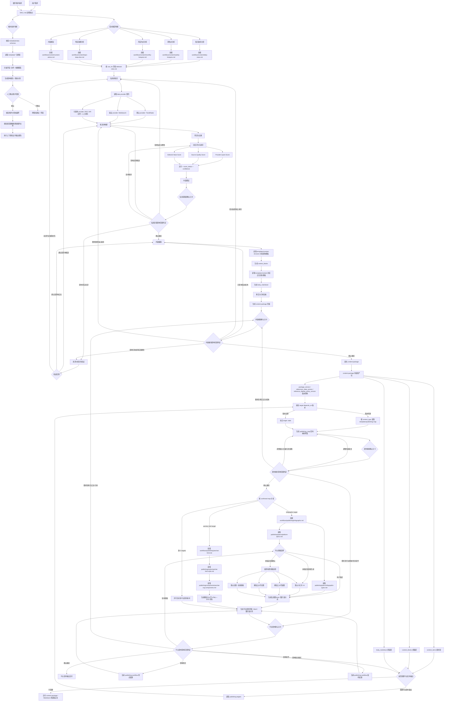
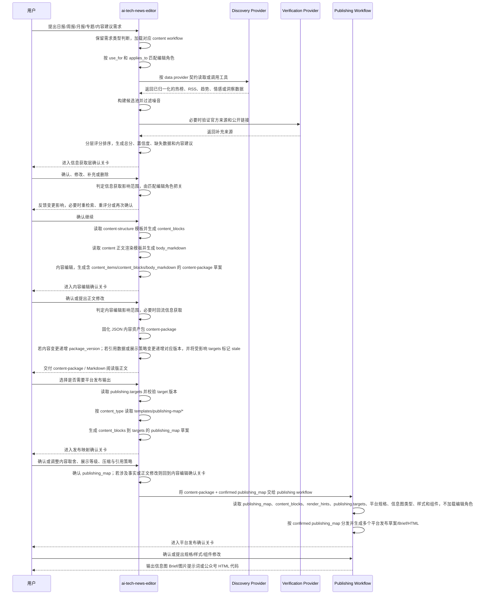

# AI Tech News Editor Skill 架构设计 v1.11

## 1. 设计目标

`ai-tech-news-editor` 是一个面向 AI 与科技领域内容生产与平台发布转化的新闻编辑 Skill。它默认以 TrendRadar 作为热点发现与趋势信号 provider、WebSearch 作为验证与补充 provider，但数据来源必须通过统一 `data_provider` 契约接入，支持后续替换为其他 RSS 聚合、数据库、API、文件或人工材料 provider。Skill 支持每日新闻文章、周热点分析、月度热点分析、特定选题分析、内容建议，并在内容生产完成后，将统一内容母版转化为信息图、微信公众号 HTML 等平台发布格式。

v0.5 在 v0.4 基础上重构确认机制；v0.5.1 在不改变主体架构的前提下修正平台发布回流、来源验证分流、content-package 状态字段和推荐执行流程顺序；v0.6 升级评分体系，使其能结合 TrendRadar 实际工具能力落地；v0.7 将 `content-package` 升级为“内容资产包”；v0.8 增加多平台发布素材并行输出能力；v0.9 增加正文结构模板层；v1.0 对内容资产包、正文结构/渲染模板和发布目标进行 schema 化增强；v1.1 根据 TrendRadar 已验证工具能力升级正文结构模板；v1.2 增加发布映射确认层；v1.3 增加发布映射模板层；v1.4 优化专题分析结构模板；v1.5 优化内容建议结构模板；v1.6 更新开发固化路径；v1.7 增加来源平台分类、来源展示格式和参考文献发布格式规范；v1.8 增加插件维护元数据层、维护自动化边界、精确更新协议和上下游验证闭环；v1.9 增加维护元数据可执行契约、全量覆盖校验、字段/文件扫描器、依赖图生成和维护计划验证；v1.10 对参考文献设计做轻量收敛；v1.11 增加轻量 data provider 抽象，把 TrendRadar 降级为默认 provider adapter，降低更换数据来源时对正文结构、发布映射和平台发布链路的影响：

- **确认关卡分层**：将单一“确认关卡”拆分为信息获取层确认关卡、内容编辑确认关卡、发布映射确认关卡、平台发布确认关卡。
- **用户反馈分层处理**：信息获取层反馈只影响信息、候选、评分与来源验证；内容编辑反馈影响正文并可回流信息获取；发布映射反馈只影响内容块进入平台的取舍、展示、压缩和引用策略；平台发布反馈只影响发布规格、样式、组件和输出格式。
- **平台发布不承接事实修改**：用户在平台发布阶段要求修改事实、标题、正文、引用或观点判断时，必须回退到内容编辑确认关卡，不在发布层直接修改内容。
- **编辑角色只参与内容生产**：信息获取层确认关卡和内容编辑确认关卡可由匹配编辑角色把关；发布映射确认关卡和平台发布确认关卡不加载编辑角色。
- **来源验证按结果分流**：来源与相关性验证通过后回到候选池或内容编辑；来源不足或需要补充时才回到信息获取层。
- **content-package 显式区分草案与确认态**：使用 `package_status` 标记 `draft` 或 `confirmed`，避免草案被误认为已确认。
- **评分模型分层落地**：将评分拆为 Provider Quant Score、Source Quality Score、Editorial Value Score，分别对应 provider 可量化信号、半自动来源校验和编辑判断。
- **评分必须带状态和置信度**：每个评分项标记 `measured`、`inferred` 或 `unavailable`，总分输出 `confidence`，避免缺失数据被误算为确定分数。
- **内容资产包升级**：`content-package` 不再只是 Markdown 包装壳，而是由 `content_items` 素材层、`content_blocks` 成稿层、`body_markdown` 阅读层组成。
- **结构与样式进一步解耦**：平台发布优先消费 `content_items` 与 `content_blocks`，`body_markdown` 作为人类阅读版正文保留。
- **多平台发布素材并行输出**：`publishing.targets` 支持多个发布目标；每个 target 独立读取同一个 confirmed `content-package`，并生成对应平台素材。
- **正文结构模板层**：每日新闻、周热点、月度热点、特定选题分析、内容建议等正文结构由 `templates/content-structure/*` 维护，内容 workflow 必须读取对应结构模板生成 `content_blocks`。
- **正文渲染模板层**：每日新闻、周热点、月度热点、特定选题分析、内容建议等正文渲染由 `templates/content/*` 维护，用于把 `content_blocks` 转换为 `body_markdown`。
- **数据源信号块层**：正文结构模板显式承接日期解析、RSS、热榜、趋势、平台分布、周期对比、预测和噪音过滤等 provider 信号，避免把具体数据源能力埋在正文段落中。
- **内容素材 schema 化**：`content_items` 明确类型体系、状态流转和关系字段，支持去重、合并、背景引用和专题时间线。
- **正文块 schema 化**：`content_blocks` 明确标准 block 类型、children 结构和 `render_hints` 字段，支持复杂排行、时间线、矩阵和多平台渲染。
- **发布目标生命周期**：`publishing.targets` 明确 `planned/draft/review/confirmed/exported/failed/stale` 状态，并通过 `package_version`、`references_data_version` 和 `reference_display_policy_version` 判断素材是否过期。
- **发布映射确认层**：confirmed `content-package` 进入平台发布前，必须先生成并确认 `publishing_map`，明确哪些 `content_blocks` 进入哪些平台、如何展示、压缩或隐藏。
- **发布映射模板层**：`templates/publishing-map/*` 按内容类型生成 `publishing_map` 草案，只负责内容块映射建议，不负责平台样式、发布规格和最终素材。
- **专题结构共用块层**：`topic-deep-dive-structure` 使用 `shared_blocks` 管理专题标题、导览和专题可视化模块，避免四类专题变体重复定义。
- **内容建议趋势信号层**：`content-advice-structure` 显式维护选题词云、热度趋势、平台活跃和情绪分布，用于支撑选题推荐而不替代编辑判断。
- **开发固化路径更新**：后续固化建议按实际开发顺序重排，先固化入口、契约、引用规则、维护元数据和五类内容模板，再实现发布映射、平台发布与维护自动化闭环。
- **data provider 可替换**：信息获取层只依赖 `schemas/data-provider.schema.md` 与 `references/data-providers.md` 定义的 provider 能力、字段映射、质量等级和限制声明；TrendRadar、WebSearch 或其他数据源不得直接污染 `content_blocks`、发布映射和平台发布层。
- **来源平台分类结构化**：`references.source_platform` 统一记录来源分类、主体、栏目/频道、媒介、说明和最终展示文本；`content_items` 与 `content_blocks` 只通过 `reference_ids` 绑定来源，不重复存来源事实或来源展示文本。
- **参考文献格式契约集中化**：`schemas/source-platform.schema.md` 统一维护 `reference_format_contract`，集中定义公开字段、内部追溯字段、展示模式和字段选择边界；`templates/content-structure/*` 不再重复定义公开/内部字段清单。
- **来源展示与内部追溯分离**：最终发布可展示 `references.source_platform.display` 和格式化参考文献，但不得展示 `used_by_items`、`used_by_blocks`、block id 或 item id；这些字段只用于映射、审计和校验。
- **展示文本不在结构层缓存**：`content_blocks.render_hints` 与 `children` 只记录 `reference_display_requirement`、`reference_display_mode` 或 `reference_policy_ref` 这类展示需求，不缓存来源展示文本；读者可见来源展示始终从 `references.source_platform.display` 派生。
- **插件维护元数据层**：使用 `metadata/*` 记录文件职责、字段归属、依赖关系、验证矩阵和维护状态，使后续字段调整优先通过元数据定位影响范围，而不是靠人工记忆同步。
- **维护自动化边界**：自动化只能生成建议、配置草案、字段映射草案、影响报告、精确更新计划和验证报告；不得自动改写事实、正式内容、正式代码或绕过确认关卡。
- **精确更新与上下游验证闭环**：凡涉及插件文件正式变更，必须先生成影响报告和更新计划，经人工确认后只更新受影响文件，并执行上游契约、当前文件和下游消费方验证。
- **维护元数据可执行契约**：`metadata/meta-schemas/*` 定义维护元数据的机器可校验结构；未登记字段、未登记文件、未登记依赖边和无执行器的验证项默认失败。
- **全插件覆盖校验**：维护脚本必须能扫描 schema、模板、workflow、发布配置、样例和维护元数据，并对字段级、文件级、依赖级覆盖率出具报告。
- **维护自动化不扩权**：v1.9 的扫描、对账、影响报告和计划校验只提高维护可靠性，不允许绕过人工确认直接改正式内容、正式 schema、正式模板、发布代码或脚本。

## 2. 核心原则

- **data provider 优先级可配置**：默认 provider 组合为 TrendRadar 负责热点发现与趋势信号、WebSearch 负责权威来源校验和官方链接补充；后续可在 `references/data-providers.md` 中替换或新增 provider，不改正文结构、发布映射或平台发布层。
- **保留需求类型判断**：日报、周报、月报、专题、内容建议仍然是一级内容生产 workflow。
- **内容生产与平台发布分层**：内容生产负责信息判断、新闻价值、事实复核和正文生成；平台发布负责格式转换、渠道适配、样式渲染和可视化表达。
- **content-package 为唯一内容资产母版**：所有内容生产 workflow 最终产出 `content-package`。JSON 管理元数据、编辑上下文、来源上下文、素材条目、成稿块、引用、评分、质量检查和发布计划；正文部分使用 Markdown 字符串。
- **版本驱动发布一致性**：`content-package.package_version` 每次内容事实、正文结构或 `body_markdown` 变更时递增；引用数据变更递增 `references_data_version`，引用展示策略变更递增 `reference_display_policy_version`，发布目标通过三类依赖判断是否需要重新生成。
- **素材层、成稿层、阅读层分离**：`content_items` 管理候选/选中/背景新闻素材；`content_blocks` 管理最终文章结构；`body_markdown` 是由成稿块生成的人类阅读版正文。
- **正文结构高内聚**：日报、周报、月报、专题分析和内容建议的正文 block 类型、顺序、必填字段、场景变体和渲染提示集中维护在 `templates/content-structure/`，不散落在 workflow 或 publishing 层。
- **数据源信号高内聚**：时间范围、来源覆盖、平台分布、趋势曲线、生命周期、周期对比、话题迁移、异常热度、预测观察和噪音过滤集中维护为标准 `content_blocks`，具体 provider 字段映射留在 provider adapter。
- **正文渲染高内聚**：日报、周报、月报、专题分析和内容建议的 Markdown 输出规则集中维护在 `templates/content/`，不散落在 workflow 或 publishing 层。
- **内容 workflow 只准备可映射内容**：不同内容类型的 workflow 必须生成可被发布映射消费的 `content_blocks`，但不得设置默认发布倾向，不得替用户决定分发平台，不得生成 HTML、SVG、图片提示词或平台成品。
- **编辑角色只参与内容生产**：编辑角色介入信息获取、候选池构建、评分判断、内容建议、信息获取层确认、内容编辑确认、来源验证与正文编辑；发布映射与平台发布阶段不加载编辑角色。
- **角色按需匹配**：内容 workflow 只加载 `references/editorial-roles.md` 中 `use_for` 匹配当前 workflow 的角色，并只在 `applies_to` 指定阶段调用。
- **四层确认关卡**：信息获取层确认关卡、内容编辑确认关卡、发布映射确认关卡、平台发布确认关卡分别处理不同阶段的用户反馈。
- **评分分层可解释**：候选排序必须区分 provider 可直接量化指标、来源质量指标和编辑价值判断，并记录 provider 来源、缺失数据与置信度。
- **平台发布后置且可多目标分发**：信息图与微信公众号 HTML 不和内容生产并行判断，必须在 `content-package` 生成、发布映射确认后执行。发布 workflow 优先读取 confirmed `publishing_map`、`content_blocks` 和 `publishing.targets`，可按多个 target 分发并汇总输出。
- **发布映射独立确认**：发布映射层只负责 `content_blocks` 到 `publishing.targets` 的内容选择、展示等级、压缩策略和引用展示策略，不修改事实、正文结构、平台样式或最终代码。
- **发布映射模板高内聚**：日报、周报、月报、专题分析和内容建议的发布映射草案规则集中维护在 `templates/publishing-map/`，不散落在 content workflow 或 publishing workflow 中。
- **引用展示由映射层选择、由 schema 约束**：`references` 保留完整来源与内部追溯字段；`schemas/source-platform.schema.md` 的 `reference_format_contract` 定义字段真源；`templates/publishing-map/*` 的 `reference_policy` 只引用统一格式 ID 并设置平台级覆盖，禁止重新定义字段真源或把内部追溯字段输出给读者。
- **平台发布不得改正文结构**：平台发布只能根据 confirmed `publishing_map`、`content_blocks` 与 `render_hints` 做格式转换、组件选择和样式渲染；如需改变正文结构，必须回到内容编辑确认关卡。
- **发布规格与样式可维护**：平台规格、信息图类型、微信公众号 HTML 样式、SVG 组件都由独立发布配置文件维护，不写死在 `SKILL.md`。
- **平台发布不得改事实**：如果用户在平台发布阶段要求改标题、正文、事实、引用或观点判断，必须回退到内容编辑确认关卡。
- **禁止事实杜撰**：不得编造新闻、链接、分数、来源、排名、时间、引用或可视化数据。
- **中文输出优先**：默认全中文输出，专有名词使用通用中文译名或保留原文并标注。
- **跨 Agent 稳定**：所有关键流程、工具用法、评分规则、确认协议、角色设定、内容包 schema、正文结构模板、正文渲染模板、发布规格、信息图类型和样式要求必须写入 Skill 文件，不依赖对话上下文。
- **元数据驱动维护**：插件维护优先读取 `metadata/file-registry.yaml`、`metadata/field-registry.yaml`、`metadata/dependency-map.yaml` 和 `metadata/validation-matrix.yaml`，用元数据判断字段归属、上下游消费者和验证范围，避免多处手工查找和同步。
- **自动化只生成维护建议**：维护自动化不得直接修改数据真实性、正式内容、正式 schema、正式模板或发布代码；它只输出配置草案、字段映射草案、影响报告、精确更新计划和验证报告。
- **人工确认后精确落盘**：影响报告经用户确认后，才允许对插件文件做精确更新；更新范围必须限于影响报告列出的文件，完成后必须做上游契约、当前文件一致性和下游消费验证。
- **非必需不复杂化**：新增元数据、脚本或维护 workflow 必须能降低真实维护成本；若一次性人工检查更简单，不引入新的自动化层或抽象层。
- **维护契约可校验**：所有维护元数据文件必须遵守 `metadata/meta-schemas/*`；meta-schema 校验失败时，不允许继续生成影响报告或执行精确更新。
- **覆盖缺口显式失败**：扫描发现未登记字段、未登记插件文件、未登记依赖边、未声明验证项或验证项无执行器时，必须输出失败或 incomplete 状态，不得静默通过。
- **自动扫描辅助人工确认**：扫描器和依赖图生成器只用于发现差异、生成草案和报告；是否接受变更、如何改正式文件，仍由人工确认决定。

## 3. 总体架构图



## 4. 建议文件目录

```text
ai-tech-news-editor/
  SKILL.md
    # Skill 入口文件。负责触发描述、需求类型判断、内容生产路由、平台发布后处理入口、四层确认关卡、硬规则和按需加载说明。

  agents/
    openai.yaml
      # UI 元数据。定义 Skill 展示名称、简短说明、默认调用提示和隐式调用策略。

  metadata/
    meta-schemas/
      plugin-manifest.schema.yaml
        # plugin-manifest.yaml 的机器可校验契约。定义必填字段、枚举、版本字段和自动化权限边界。

      file-registry.schema.yaml
        # file-registry.yaml 的机器可校验契约。定义文件 ID、路径、层级、职责、上下游和验证键。

      field-registry.schema.yaml
        # field-registry.yaml 的机器可校验契约。定义字段 ID、字段路径、定义位置、读写方、风险等级和覆盖规则。

      dependency-map.schema.yaml
        # dependency-map.yaml 的机器可校验契约。定义依赖节点、边类型、来源、置信度和 incomplete 标记。

      validation-matrix.schema.yaml
        # validation-matrix.yaml 的机器可校验契约。定义触发条件、验证键、执行器、输入、输出和通过标准。

    plugin-manifest.yaml
      # 插件维护总清单。记录插件版本、架构版本、维护状态、主要入口文件和确认门槛，不承载内容事实。

    file-registry.yaml
      # 文件职责注册表。记录每个插件文件的所属层、主责、允许修改字段、禁止承载内容和上游/下游依赖。

    field-registry.yaml
      # 字段归属注册表。记录关键字段的 owner、定义位置、允许消费者、公开/内部属性、变更类型和迁移要求。

    dependency-map.yaml
      # 依赖关系图。记录 schema、模板、workflow、样例、发布配置和验证项之间的读取/生成/消费关系。

    validation-matrix.yaml
      # 维护验证矩阵。把字段或文件变更映射到必须执行的上游契约、当前文件和下游消费验证。

  references/
    editorial-roles.md
      # 内容生产编辑角色库。用 use_for 匹配 workflow，用 applies_to 匹配介入阶段；不用于平台发布。

    trendradar-tools.md
      # TrendRadar provider adapter 说明。记录本地 output、MCP 工具用途、字段映射、能力边界和限制。

    data-providers.md
      # 数据源 provider 总契约。定义 provider 类型、优先级、能力矩阵、字段映射、质量等级、受限声明和替换规则。

    source-and-verification.md
      # 信息源优先级与验证规则。规定 provider 组合、RSS、热榜、官方来源、WebSearch 和人工材料的使用边界。

    scoring.md
      # 分层评分框架。定义 Provider 可量化分、来源质量分、编辑价值分、字段映射、缺失数据状态、置信度和不同 workflow 权重。

    confirmation/
      information-confirmation.md
        # 信息获取层确认协议。处理候选、评分、主题范围、时间范围、补充材料、来源验证等反馈。

      editorial-confirmation.md
        # 内容编辑确认协议。处理标题、导语、正文结构、观点总结、引用准确性和新增事实反馈。

      publishing-confirmation.md
        # 平台发布确认协议。处理规格、样式、组件、输出格式反馈；不加载编辑角色。

      publishing-mapping-confirmation.md
        # 发布映射确认协议。处理 content_blocks 到 publishing.targets 的展示、压缩、隐藏和引用策略；不修改事实和平台样式。

  schemas/
    content-package.schema.md
      # JSON + Markdown 内容资产包结构说明。定义元数据、编辑上下文、来源上下文、素材层、成稿层、阅读正文、引用、评分、质量检查和发布计划字段。

    item-types.md
      # content_items 类型、状态和 relationships 关系枚举。用于约束素材层扩展。

    block-types.md
      # content_blocks 类型、children 结构和 render_hints 字段枚举。用于约束成稿层扩展。

    data-provider.schema.md
      # 数据源 provider 契约。定义 provider_id、capability、field_mapping、quality_policy、limitations 和 normalized_signal_blocks。

    source-platform.schema.md
      # 来源平台分类与参考文献格式契约。集中定义 references.source_platform.display、公开字段、内部追溯字段、展示模式和字段选择边界。

    publishing-targets.md
      # publishing.targets 生命周期、版本依赖和输出字段说明。用于约束多平台发布素材流转。

    publishing-map.schema.md
      # publishing_map 结构说明。定义 block_mapping、visibility_policy、compression_policy、reference_policy 和用户确认状态；reference_policy 只引用统一参考文献格式 ID，可做平台级覆盖。

  workflows/
    content/
      daily-news.md
        # 每日 AI 与科技新闻文章工作流。输出经过事实与引用复核的 content-package。

      weekly-hotspots.md
        # 周热点分析工作流。输出周热点分析 content-package。

      monthly-hotspots.md
        # 月度热点分析工作流。输出月度热点分析 content-package。

      topic-deep-dive.md
        # 特定选题分析工作流。输出专题分析 content-package。

      content-advice.md
        # 内容建议工作流。用于输出选题建议、标题方向、内容角度和受众价值判断；必要时可扩展为 content-package。

    publishing/
      infographic.md
        # 平台发布转化工作流。消费 confirmed content-package 与 confirmed publishing_map，读取 publishing.targets、平台规格和信息图类型，生成一个或多个信息图 Brief、图片提示词或图像生成方案。

      wechat-html.md
        # 平台发布转化工作流。消费 confirmed content-package 与 confirmed publishing_map，读取 publishing.targets，生成一个或多个微信公众号可用 HTML 与 SVG 代码。

    maintenance/
      impact-analysis.md
        # 维护影响分析工作流。读取 metadata 注册表，输出字段/文件变更的上下游影响报告，不修改正式文件。

      config-draft.md
        # 配置草案生成工作流。为 schema、模板、发布规格或验证矩阵生成建议草案，等待人工确认。

      field-mapping-draft.md
        # 字段映射草案工作流。为新增、重命名、拆分或迁移字段生成映射建议和迁移风险说明。

      precise-update.md
        # 精确更新工作流。仅在人工确认影响报告后，按批准范围更新插件文件，并记录更新摘要。

      post-update-validation.md
        # 更新后验证工作流。执行 metadata 指定的上游、当前和下游验证，输出验证报告。

  scripts/
    validate-metadata.mjs
      # 低风险校验脚本。检查 metadata 注册表、文件存在性、字段归属和依赖关系，不改正式文件。

    validate-architecture.mjs
      # 低风险校验脚本。检查架构文件目录、章节、命名和关键约束是否一致，不生成内容事实。

    scan-fields.mjs
      # 字段扫描脚本。扫描 schemas、templates、workflows、publishing、examples 中的字段引用，输出字段清单和来源位置。

    scan-file-registry.mjs
      # 文件扫描脚本。扫描插件目录文件，并与 file-registry.yaml 对账，发现未登记或失效文件。

    build-dependency-map.mjs
      # 依赖图生成脚本。根据 registry、扫描结果和显式依赖规则生成 dependency-map 草案或差异报告。

    check-registry-coverage.mjs
      # 覆盖率检查脚本。检查字段、文件、依赖边、验证项和执行器是否登记完整。

    generate-impact-report.mjs
      # 影响报告生成脚本。根据变更请求、registry、依赖图和验证矩阵输出影响报告，不修改正式文件。

    validate-maintenance-plan.mjs
      # 维护计划验证脚本。检查精确更新计划是否有人工确认、是否越界、是否覆盖必要验证。

  templates/
    content/
      candidate-list.md
        # 候选新闻列表模板。用于展示初筛后的候选条目。

      scoring-list.md
        # 分层评分排序模板。用于展示标题、总分、置信度、分层得分、来源链接、缺失数据和采纳建议。

      content-package.json
        # content-package JSON 模板。包含 content_items、content_blocks 和 body_markdown。

      markdown-body.md
        # 通用 Markdown 正文渲染模板。定义 content_blocks 到 body_markdown 的基础拼接规则，作为各内容类型正文模板的兜底模板。

      daily-news-article.md
        # 每日新闻正文渲染模板。读取 daily-news-structure 生成的 content_blocks，输出日报 body_markdown。

      weekly-analysis.md
        # 周热点分析正文渲染模板。读取 weekly-hotspots-structure 生成的 content_blocks，输出周报 body_markdown。

      monthly-analysis.md
        # 月度热点分析正文渲染模板。读取 monthly-hotspots-structure 生成的 content_blocks，输出月报 body_markdown。

      topic-deep-dive-article.md
        # 特定选题分析正文渲染模板。读取 topic-deep-dive-structure 生成的 content_blocks，并按 content_structure_variant 输出专题 body_markdown。

      content-advice-article.md
        # 内容建议正文渲染模板。读取 content-advice-structure 生成的 content_blocks，输出建议型 body_markdown 或后续流转建议正文。

    content-structure/
      daily-news-structure.md
        # 每日新闻正文结构模板。定义日报 content_blocks 的类型、顺序、必填字段和 render_hints。

      weekly-hotspots-structure.md
        # 周热点正文结构模板。定义周报 content_blocks 的热点排行、趋势、事件、风险和预测结构。

      monthly-hotspots-structure.md
        # 月度热点正文结构模板。定义月报 content_blocks 的月度总览、核心主题、时间线、公司格局和预测结构。

      topic-deep-dive-structure.md
        # 特定选题分析正文结构模板。定义通用专题、产品/工具推荐、GitHub 项目推荐、AI 与科技背景社会洞察等场景变体。

      content-advice-structure.md
        # 内容建议正文结构模板。定义选题建议、推荐排序、编辑理由、风险提示和后续流转建议。

    publishing-map/
      daily-news-map.md
        # 每日新闻发布映射模板。根据日报 content_blocks 生成 publishing_map 草案，不决定最终平台分发。

      weekly-hotspots-map.md
        # 周热点发布映射模板。根据周报 content_blocks 生成 publishing_map 草案，不生成平台样式或成品。

      monthly-hotspots-map.md
        # 月度热点发布映射模板。根据月报 content_blocks 生成 publishing_map 草案，处理长周期结构压缩建议。

      topic-deep-dive-map.md
        # 特定选题发布映射模板。根据专题 content_blocks 和 content_structure_variant 生成 publishing_map 草案。

      content-advice-map.md
        # 内容建议发布映射模板。仅在内容建议生成 content-package 并进入发布阶段时使用。

    publishing/
      infographic-brief.md
        # 信息图 Brief 输出模板。支持按 publishing target 输出多个 Brief。

      wechat-html-output.md
        # 微信公众号 HTML 输出模板。支持按 publishing target 输出多个 HTML 片段或素材包。

  publishing/
    specs/
      platform-specs.md
        # 平台发布规格库。定义小红书、微信公众号贴图、微信公众号长图、公众号封面、正文内嵌图等渠道规格。

      infographic-types.md
        # 信息图类型库。定义热点排行、时间线、公司矩阵、趋势雷达、风险机会四象限等表达类型。

    styles/
      wechat-html-style.md
        # 微信公众号 HTML 样式库。定义排版风格、字号、颜色、段落间距和移动端阅读规范。

    components/
      wechat-svg-components.md
        # 微信公众号可用 SVG/HTML 组件库。定义时间线、排行条、重点数字卡、风险机会矩阵等组件。

  examples/
    daily-news-content-package.md
      # 日报 content-package 样例。用于回归检查内容资产包结构，不作为用户文档。

    weekly-hotspots-content-package.md
      # 周热点 content-package 样例。用于检查周报排行、趋势、平台分布、情绪和预测结构。

    monthly-hotspots-content-package.md
      # 月度热点 content-package 样例。用于检查月报主题、时间线、公司格局、趋势和预测结构。

    topic-deep-dive-content-package.md
      # 专题 content-package 样例。用于检查 content_structure_variant 和专题结构流转。

    content-advice-content-package.md
      # 内容建议 content-package 样例。用于检查选题信号、推荐排序、编辑理由和后续流转建议。

    publishing-map-daily-news.md
      # 日报发布映射样例。用于检查 block_mapping、可见性、压缩和引用展示策略。

    publishing-map-topic-deep-dive.md
      # 专题发布映射样例。用于检查 shared_blocks、content_structure_variant 和平台展示取舍。

    wechat-html-output.md
      # 微信公众号 HTML 输出样例。用于检查发布目标版本依赖和 HTML 输出边界。

    infographic-brief.md
      # 信息图 Brief 输出样例。用于检查信息图发布 target 与规格/类型映射。

```

## 5. 文件内容说明

### 5.1 `SKILL.md`

`SKILL.md` 是整个 Skill 的入口和总控文件，应保持精简，不承载所有细节。

建议包含：

- Skill 定位：AI 与科技领域新闻编辑与平台发布转化中枢。
- 需求类型判断：日报、周报、月报、专题、内容建议。
- 内容生产路由：根据需求加载 `workflows/content/*`。
- 编辑角色匹配规则：只加载 `use_for` 匹配当前 workflow 的角色，并只在 `applies_to` 指定阶段调用。
- 信息源优先级：默认 provider 组合、可替换 provider、verification provider。
- content-package 母版规则：内容生产 workflow 必须输出 JSON 内容资产包，包含 `content_items`、`content_blocks` 和 `body_markdown`。
- 正文结构模板规则：内容 workflow 必须读取对应 `templates/content-structure/*` 文件生成 `content_blocks`。
- 正文渲染模板规则：内容 workflow 必须读取对应 `templates/content/*` 文件，将已校验的 `content_blocks` 渲染为 `body_markdown`。
- 可映射输出规则：内容 workflow 生成的 `content_blocks` 必须包含 `item_ids`、`reference_ids`、`children`、`visibility` 和 `render_hints`；不得设置默认发布平台或生成平台成品。
- 发布映射模板规则：生成 `publishing_map` 草案前，必须按 `content_type` 读取对应 `templates/publishing-map/*`；该模板只生成映射建议，不替用户确认。
- 四层确认关卡：信息获取层确认、内容编辑确认、发布映射确认、平台发布确认。
- 平台发布后处理入口：只有在 content-package 生成并确认后，才进入信息图或微信公众号 HTML 转化。
- 发布映射确认入口：只有在 content-package confirmed 且 publishing target 版本有效后，才生成并确认 `publishing_map`。
- 平台发布禁令：平台发布阶段不得新增或修改事实、引用、结论；如用户要求改内容，回退到内容编辑确认关卡。
- 硬规则：不得杜撰、中文输出、数据源受限声明、用户补充材料验证、发布规格确认。

### 5.2 `references/editorial-roles.md`

编辑角色库用于内容生产链路，而不是平台发布链路。

角色匹配规则：

- `use_for` 用于匹配 workflow，例如 `daily-news`、`weekly-hotspots`、`monthly-hotspots`、`topic-deep-dive`、`content-advice`。
- `applies_to` 用于匹配介入阶段，例如 `information-gathering`、`candidate-pool`、`scoring`、`content-advice`、`information-confirmation`、`editorial-confirmation`、`source-verification`、`drafting`。
- 内容 workflow 只能加载 `use_for` 匹配当前任务的角色。
- 当前阶段只能调用 `applies_to` 覆盖该阶段的角色。
- 平台发布 workflow 不得加载或引用编辑角色。

编辑角色介入范围：

- 信息获取层：判断是否需要补充 discovery provider 查询或 verification provider 校验。
- 候选池构建：判断候选是否符合新闻价值、主题相关性和来源质量。
- 评分排序：判断权重是否符合当前内容类型。
- 内容建议：根据用户目标推荐保留、降级、替换或补充。
- 信息获取层确认：根据用户反馈判断是否触发重新检索、重新评分或来源验证。
- 来源与相关性验证：判断用户补充材料能否进入候选池或正文。
- 内容编辑确认：判断正文修改是否只影响表达，还是需要回流信息获取、候选池或来源验证。
- 正文编辑：把控结构、语言、事实边界和结论强度。

建议初始角色：

```markdown
# Editorial Roles

## Chief AI Tech Editor
- use_for: daily-news, weekly-hotspots, monthly-hotspots
- applies_to: information-gathering, candidate-pool, content-advice, information-confirmation, editorial-confirmation, source-verification, drafting
- focus: 新闻价值、事实准确、信息密度、行业趋势
- tone: 专业、克制、判断明确
- avoid: 营销腔、夸张标题、未经证实的预测

## Breaking News Editor
- use_for: daily-news, content-advice
- applies_to: information-gathering, candidate-pool, scoring, information-confirmation, editorial-confirmation, drafting
- focus: 时效性、核心事实、快速判断
- tone: 简洁、直接、低修饰

## Industry Analyst Editor
- use_for: weekly-hotspots, monthly-hotspots, topic-deep-dive
- applies_to: candidate-pool, scoring, content-advice, information-confirmation, editorial-confirmation, drafting
- focus: 趋势、产业链、竞争格局、风险机会
- tone: 分析型、结构化、证据驱动
```

维护规则：

- 可新增角色，但必须声明 `use_for` 和 `applies_to`。
- 可修改角色风格，但不得破坏事实准确和来源约束。
- workflow 引用角色时，只引用与当前任务和当前阶段相关的角色。
- 平台发布 workflow 不得加载或引用编辑角色。

### 5.3 `references/data-providers.md`

定义数据源 provider 的统一接入契约。它是更换数据来源时的主维护点，避免把某个具体工具写死到 workflow、正文结构模板、发布映射或平台发布层。

建议字段：

```yaml
providers:
  - provider_id: trendradar
    provider_type: trend_discovery
    default_role: discovery_and_trend_signal
    priority: 1
    adapter_ref: references/trendradar-tools.md
    capabilities:
      - date_range_resolution
      - rss_search
      - trend_analysis
      - sentiment_analysis
      - platform_activity
      - period_comparison
    normalized_signal_blocks:
      - block_time_scope
      - block_source_coverage
      - block_hot_keyword_cloud
      - block_trend_curve
      - block_platform_distribution
      - block_sentiment_distribution
      - block_noise_filter_notes
    field_mapping:
      title: provider_item.title
      url: provider_item.url
      platform: provider_item.platform
      published_at: provider_item.published_at
      score_signal: provider_item.rank_or_count
    quality_policy:
      can_discover_candidates: true
      can_confirm_facts_alone: false
      requires_verification_for_official_claims: true
    limitation_statement: "用于热点发现和趋势信号，不替代最终事实验证。"

  - provider_id: websearch
    provider_type: verification
    default_role: verification_and_official_source_completion
    priority: 2
    capabilities:
      - official_source_lookup
      - link_validation
      - background_verification
    normalized_signal_blocks:
      - block_candidate_sources
      - block_source_coverage
      - block_data_basis
    quality_policy:
      can_discover_candidates: true
      can_confirm_facts_alone: true
      requires_verification_for_official_claims: false
```

维护规则：

- 新增或替换数据源时，优先新增 provider 条目和字段映射，不改 `content-package` 主契约、正文结构模板、发布映射模板或平台发布 workflow。
- provider 必须声明 `capabilities`、`field_mapping`、`quality_policy`、`normalized_signal_blocks` 和 `limitation_statement`。
- workflow 只能读取 provider 的标准能力和标准化信号块，不得直接依赖 provider 私有字段。
- provider 私有字段必须在 adapter 中归一化为 `content_items`、`references`、`scoring` 或标准 `content_blocks` 可消费字段。
- 当 provider 无法提供某个能力时，必须写入 `data_limitations`，并降低对应评分或结论置信度。

### 5.3A `references/trendradar-tools.md`

记录 TrendRadar provider adapter 的工具能力和使用策略。

应说明：

- 本地 `output` 是首选数据入口。
- `resolve_date_range` 用于把“今天”“最近7天”“本周”“本月”等自然语言日期解析为标准 `date_range`。
- `get_rss_feeds_status` 用于查看 RSS 覆盖日期、源列表和当日数据量，支撑数据覆盖说明。
- `get_latest_rss` 用于获取最新 RSS 条目，适合补充新产品、开源项目、官方动态和技术文章。
- `search_rss` 用于关键词检索，但短关键词容易误命中，必须语义过滤。
- `analyze_sentiment` 用于获取热榜标题、平台、排名序列、出现次数和 URL；该工具返回的是情感分析提示词和标题数据，不直接等同于最终情感结论。
- `analyze_topic_trend` 用于趋势、生命周期、异常热度和预测；`trend`、`lifecycle` 较稳定，`viral`、`predict` 必须人工过滤噪音。
- `analyze_data_insights` 用于平台对比、平台活跃度和关键词共现；`platform_activity` 较稳定，`keyword_cooccur` 可能出现停用词或英文噪音。
- `compare_periods` 用于时期对比，支持 `overview`、`topic_shift`、`platform_activity`，适合周报、月报和专题复盘。

工具能力映射：

```text
resolve_date_range -> block_time_scope
get_rss_feeds_status -> block_source_coverage
get_latest_rss/search_rss -> block_candidate_sources, block_noise_filter_notes
analyze_sentiment -> block_platform_distribution, block_sentiment_overview
analyze_topic_trend(trend) -> block_trend_curve
analyze_topic_trend(lifecycle) -> block_lifecycle_stage
analyze_topic_trend(viral) -> block_viral_signals
analyze_topic_trend(predict) -> block_prediction_watch
analyze_data_insights(platform_activity/platform_compare) -> block_platform_distribution
analyze_data_insights(keyword_cooccur) -> block_topic_shift, block_noise_filter_notes
compare_periods -> block_period_comparison, block_topic_shift
```

使用边界：

- TrendRadar 是默认热点发现与趋势信号 provider，适合发现热点、判断热度、捕捉趋势和建立候选池。
- TrendRadar 不替代最终事实验证；官方公告、论文、产品页、GitHub 仓库状态、监管文件仍需验证型 provider 或权威来源补充验证。
- TrendRadar 私有字段必须通过 `references/data-providers.md#trendradar` 映射到标准 provider 信号；workflow 不得直接依赖未登记私有字段。
- 任何 `viral`、`predict`、`keyword_cooccur` 结果进入正文前，必须经过编辑角色过滤并记录噪音处理。

### 5.4 `references/source-and-verification.md`

定义信息源使用边界。

建议包含：

- discovery provider 用于发现热点、判断热度、构建候选池；默认实现为 TrendRadar。
- verification provider 用于官方公告、主流媒体、论文、产品页、监管文件和链接校验；默认实现为 WebSearch。
- 用户材料、本地文件、第三方 API 或数据库可作为 supplemental provider，但必须先通过 `references/data-providers.md` 声明能力、字段映射和限制。
- 用户补充材料必须验证来源可信度、时间匹配度、主题相关性、事实完整度和可引用性。
- 来源不足时必须声明“数据源受限”，并降低结论确定性。
- 每条可引用来源必须归一化 `source_platform`，至少包含 `category`、`owner`、`channel`、`medium`、`display`。
- `category` 建议使用：`official`、`official_social`、`general_news`、`research_institution`、`academic_paper`、`github_repository`、`community_kol`、`regulatory`、`company_blog`、`data_platform`、`unknown`。
- `display` 是面向读者的来源展示文本，格式为“来源分类 来源主体：栏目/频道（媒介或说明）”，例如“官方 Anthropic：Newsroom（网页）”“综合资讯 IT之家（RSS）”“学术机构 Berkeley RDI：Blog（AI 安全与评测）”“官方·X X：阿里云 / Alibaba Cloud (@alibaba_cloud)”。
- 若来源主体、栏目或媒介无法确认，必须写入 `unknown` 或在 `note` 中说明，不得为了展示完整而补造来源平台。

### 5.5 `references/scoring.md`

定义分层评分框架。评分必须结合 provider 的实际工具能力落地，不能把所有维度都当作机器可直接计算。

#### 5.5.1 评分分层

```text
A. Provider Quant Score
   机器可算，主要来自已登记 discovery provider 的热榜、RSS、趋势、情感和数据洞察工具。

B. Source Quality Score
   半自动评分，主要来自来源平台、URL、官方/主流媒体校验和链接可访问性。

C. Editorial Value Score
   编辑判断评分，由匹配编辑角色把关，覆盖新闻价值、事实完整度、用户目标匹配度和风险不确定性。
```

#### 5.5.2 Provider 字段映射

```text
热度/排名
- 主要工具：analyze_sentiment、本地 output、平台热榜数据
- 可用字段：ranks、count、platform、sort_by_weight 返回顺序
- score_status: measured

持续时间
- 主要工具：analyze_sentiment、analyze_topic_trend、本地 output
- 可用字段：ranks 数组长度、count、多日 date/count、total_mentions、peak_time
- score_status: measured 或 inferred

跨平台分布
- 主要工具：analyze_sentiment、analyze_data_insights(platform_compare)、search_rss
- 可用字段：platforms、platform、feeds、total_platforms
- score_status: measured

时效性
- 主要工具：get_latest_rss、search_rss、本地 output
- 可用字段：published_at、date、fetch_time
- score_status: measured 或 inferred
- 注意：热榜数据不一定有精确首发时间，不能强行按小时精算。

话题集中度
- 主要工具：analyze_topic_trend、analyze_data_insights(keyword_cooccur)
- 可用字段：total_mentions、average_mentions、peak_count、change_rate、trend_direction、keyword co-occurrence
- score_status: measured

情感与风险氛围
- 主要工具：analyze_sentiment
- 可用字段：ai_prompt、data、platforms、标题样本
- score_status: inferred
- 注意：该工具返回的是情感分析提示词和标题数据，不一定直接返回最终情感分类；需要编辑角色或模型进一步判断。
```

#### 5.5.3 Source Quality Score

```text
来源权威性
- 主要依据：source-and-verification.md 中维护的来源等级表。
- discovery provider 可提供 platform、feed_name、url 等字段，但不直接判断权威性。
- 官方公告、公司博客、论文、监管文件、主流媒体优先级高。

链接可访问性
- 主要依据：provider URL、RSS URL、verification provider 校验。
- URL 缺失、访问失败或仅二手转述时降低分数。

来源多样性
- 主要依据：跨平台分布和是否有 RSS/媒体/官方来源交叉验证。
```

#### 5.5.4 Editorial Value Score

必须由匹配当前 workflow 的编辑角色把关。

```text
新闻价值
- 影响范围
- 主体重要性
- 技术或产业意义
- 是否代表趋势拐点
- 是否具有受众价值

事实完整度
- 是否具备主体、动作、时间、来源、影响
- 是否有可引用链接
- 是否存在明显信息缺口

用户目标匹配度
- 是否符合用户指定主题、时间范围、关注公司和内容形态

风险与不确定性
- 是否涉及未证实消息
- 是否涉及监管、司法、医疗、金融、公司经营等高风险表述
- 是否需要降低结论确定性
```

#### 5.5.5 缺失数据处理

每个评分项必须标记状态：

```text
measured: provider 或可验证来源提供了足够字段，可直接计算。
inferred: 字段不完整，但可基于标题、平台、时间戳、趋势样本合理推断。
unavailable: 数据不足，不能计算，必须说明缺失原因。
```

缺失数据规则：

- 不得把 `unavailable` 直接记为 0 分，除非评分项明确表示缺失本身构成负面信号。
- 若关键维度 `unavailable` 过多，总分必须降低 `confidence`。
- 候选列表必须显示关键缺失项，例如“缺官方来源”“缺精确发布时间”“缺跨平台证据”。

#### 5.5.6 总分与置信度

每条候选新闻输出：

```json
{
  "title": "新闻标题",
  "total_score": 8.2,
  "confidence": "high | medium | low",
  "score_breakdown": {
    "provider_quant": {
      "score": 7.8,
      "status": "measured"
    },
    "source_quality": {
      "score": 8.5,
      "status": "inferred"
    },
    "editorial_value": {
      "score": 8.3,
      "status": "measured"
    }
  },
  "missing_data": [],
  "reason": "简短说明为何排名靠前"
}
```

置信度规则：

```text
high: 大部分关键维度 measured，且来源可靠。
medium: 部分维度 inferred，但不影响基本判断。
low: 多个关键维度 unavailable，或来源可靠性不足。
```

#### 5.5.7 不同 workflow 的默认权重

```text
每日新闻文章
- Provider Quant Score: 80%
- Source Quality Score: 10%
- Editorial Value Score: 10%

周热点分析
- Provider Quant Score: 60%
- Source Quality Score: 20%
- Editorial Value Score: 20%

月度热点分析
- Provider Quant Score: 60%
- Source Quality Score: 20%
- Editorial Value Score: 20%

特定选题分析
- Provider Quant Score: 35%
- Source Quality Score: 25%
- Editorial Value Score: 40%

内容建议
- Provider Quant Score: 45%
- Source Quality Score: 15%
- Editorial Value Score: 40%
```

#### 5.5.8 输出要求

评分排序列表必须包含：

- 中文标题。
- 内容概述。
- 总分。
- 置信度。
- 主要来源链接。
- 关键评分依据。
- 缺失数据提示。
- 是否建议纳入正文。

不得只输出裸分数。分数必须能追溯到 provider 字段、来源质量判断或编辑角色判断。主要来源链接优先首发来源或权威信息来源。

### 5.6 `references/confirmation/information-confirmation.md`

信息获取层确认协议。

适用位置：

```text
信息获取 -> 候选池构建 -> 筛选去重 -> 评分排序 -> 内容建议 -> 信息获取层确认关卡
```

处理用户反馈：

- 改主题范围。
- 改时间范围。
- 增删关键词。
- 增删关注主体。
- 补充新闻链接或材料。
- 删除候选新闻。
- 要求重新排序。
- 要求多关注某类新闻。

影响范围判定：

```text
确认继续 -> 进入内容编辑
影响信息完整性 -> 回到信息获取层
影响选题/候选 -> 回到候选池构建
影响事实/来源 -> 回到来源与相关性验证；验证通过后回到候选池或内容编辑，来源不足或需补充时回到信息获取
影响排序 -> 回到评分与排序
```

角色规则：

- 必须由匹配当前 workflow 的编辑角色把关。
- 若用户补充材料来源不明，必须先做来源与相关性验证。
- 若数据源不足，必须声明“数据源受限”并降低结论确定性。

### 5.7 `references/confirmation/editorial-confirmation.md`

内容编辑确认协议。

适用位置：

```text
内容编辑 -> 事实与引用复核 -> 生成 content-package 草案 -> 内容编辑确认关卡
```

处理用户反馈：

- 改标题。
- 改导语。
- 调整正文结构。
- 改语言风格。
- 增删正文段落。
- 增强观点总结。
- 调整预测与行动建议。
- 要求补充某个事件进正文。

影响范围判定：

```text
确认继续 -> 固化 content-package
只影响表达/结构 -> 回到内容编辑
影响引用或事实准确性 -> 回到来源与相关性验证；验证通过后回到内容编辑，来源不足或需补充时回到信息获取
要求新增事实/事件 -> 回到信息获取层
要求替换核心新闻 -> 回到候选池构建或评分排序
```

角色规则：

- 必须由匹配当前 workflow 的编辑角色把关。
- 如果用户要求新增事实、替换核心新闻或调整事实判断，不能只在正文层修改，必须回流信息获取或来源验证。
- 固化 content-package 前必须保证 `content_items`、`content_blocks`、`body_markdown`、元数据、引用和质量检查字段一致。

### 5.8 `references/confirmation/publishing-confirmation.md`

平台发布确认协议。

适用位置：

```text
content-package 已确认 -> publishing_map 已确认 -> 平台发布 workflow -> 平台发布草案/HTML/Brief -> 平台发布确认关卡
```

处理用户反馈：

- 改尺寸。
- 改平台规格。
- 改信息图类型。
- 改配色。
- 改组件。
- 改卡片数量。
- 改微信公众号 HTML 排版。
- 改 SVG 图表形式。

影响范围判定：

```text
确认继续 -> 交付平台发布输出
影响规格 -> 回到平台规格选择
影响样式 -> 回到当前 publishing workflow 的样式配置
影响组件 -> 回到当前 publishing workflow 的组件配置
影响输出格式 -> 回到“是否需要平台发布输出”
要求改事实/标题/正文/引用/观点判断 -> 回到内容编辑确认关卡
```

角色规则：

- 禁止加载 `references/editorial-roles.md`。
- 平台发布反馈只影响发布层。
- 不得在发布层修改 `content-package` 中的事实、正文、引用、标题和观点判断。

### 5.9 `references/confirmation/publishing-mapping-confirmation.md`

发布映射确认协议。

适用位置：

```text
confirmed content-package -> 校验 publishing.targets 版本 -> 生成 publishing_map -> 发布映射确认关卡 -> publishing workflow
```

处理用户反馈：

- 调整哪些 `content_blocks` 进入某个平台。
- 调整某个 block 是公开展示、条件展示还是内部保留。
- 调整某个 block 是全文展示、摘要展示、卡片展示、图表展示、来源说明还是隐藏。
- 调整引用展示方式，例如完整链接、紧凑来源、脚注、隐藏但保留。
- 调整内容压缩方式，例如不压缩、摘要、提取要点、分页拆分。
- 要求公开或隐藏数据源信号块，例如 `source_coverage`、`noise_filter_notes`、`data_basis`。

影响范围判定：

```text
确认继续 -> 进入对应 publishing workflow
调整内容取舍 -> 更新 publishing_map.block_mapping
调整展示等级 -> 更新 publishing_map.visibility_policy
调整压缩方式 -> 更新 publishing_map.compression_policy
调整引用展示 -> 更新 publishing_map.reference_policy
要求改事实/标题/正文/引用/观点判断 -> 回到内容编辑确认关卡
要求改平台尺寸/样式/组件/输出格式 -> 回到平台发布确认关卡或 publishing 配置
```

角色规则：

- 禁止加载 `references/editorial-roles.md`。
- 发布映射确认只处理 confirmed `content_blocks` 到 `publishing.targets` 的映射。
- 不得新增、删除、重排或改写 `content_blocks`。
- 不得生成 HTML、SVG、图片提示词或最终平台样式。
- 若用户要求修改内容事实、正文结构或观点判断，必须回到内容编辑确认关卡。

### 5.10 `schemas/content-package.schema.md`

定义 `content-package` 的结构。它是内容生产与平台发布之间的唯一内容资产母版，不是单纯的 Markdown 包装壳。

核心分层：

```text
content_items: 素材层，管理候选、选中、背景、替换或拒绝的新闻/热点/事件/趋势。
content_blocks: 成稿层，管理最终文章结构、章节、段落、卡片和引用关系。
body_markdown: 阅读层，由 content_blocks 拼接生成，服务人工阅读和 Markdown 交付。
```

建议字段：

> 以下示例为了说明字段含义，使用带 `#` 注释的结构化示例；实际保存为 JSON 文件时必须移除所有 `#` 注释。

```text
{
  # Schema 版本。content-package 结构升级时递增。
  "schema_version": "0.2",

  # 内容包状态。草案为 draft，内容编辑确认后为 confirmed。
  "package_status": "draft",

  # 内容包版本。每次事实、正文结构或 body_markdown 变更时递增；纯引用展示策略变更不递增该版本。
  "package_version": "0.1",

  # 引用数据版本。引用事实、URL、发布时间、抓取时间、来源分类或 source_platform.display 变更时递增。
  "references_data_version": "0.1",

  # 引用展示策略版本。只在参考文献格式契约或展示策略变更时递增，避免展示规则调整误判全部内容事实过期。
  "reference_display_policy_version": "0.1",

  # 内容包唯一 ID。建议包含内容类型和日期。
  "content_id": "ai-tech-news-2026-05-09",

  # 内容类型。用于匹配 workflow 和模板。
  "content_type": "daily_news",

  # 主输出语言。
  "language": "zh-CN",

  # 多语言扩展容器。暂不启用时为空对象。
  "localized": {},

  # 文章级元数据，用于标题、摘要、关键词和实体管理。
  "metadata": {
    "title": "今日 AI 与科技要闻",
    "subtitle": "2026 年 5 月 9 日",
    "summary": [
      "实时语音、多模态和 AI 基础研究成为今日焦点。"
    ],
    "keywords": ["AI", "OpenAI", "多模态"],
    "entities": ["OpenAI", "华为"]
  },

  # 编辑上下文。记录 workflow、编辑角色、用户要求和选题策略。
  "editorial_context": {
    "workflow": "daily-news",
    "editorial_roles_used": [
      "Chief AI Tech Editor",
      "Breaking News Editor"
    ],

    # 正文结构模板 ID。用于追踪 content_blocks 按哪个结构模板生成。
    "content_structure_id": "daily-news-structure",

    # 正文结构变体。日报、周报、月报可为 default；专题分析必须记录具体场景变体。
    "content_structure_variant": "default",

    # 必填结构块检查结果。固化 content-package 前必须通过。
    "required_blocks_passed": true,

    # 实际启用的可选结构块。用于后续审计和平台发布压缩。
    "optional_blocks_used": [],

    "user_requirements": {
      "date_range": {
        "start": "2026-05-09",
        "end": "2026-05-09"
      },
      "topic_scope": ["AI", "科技"],
      "language": "zh-CN"
    },
    "selection_policy": {
      "target_count": 10,
      "preferred_topics": ["大模型", "AI 视频", "机器人"],
      "excluded_topics": []
    }
  },

  # 来源上下文。记录 data provider 使用情况、字段映射、数据限制和验证备注。
  "source_context": {
    "provider_contract_ref": "schemas/data-provider.schema.md",
    "providers": [
      {
        "provider_id": "trendradar",
        "role": "discovery_and_trend_signal",
        "priority": 1,
        "adapter_ref": "references/trendradar-tools.md",
        "field_mapping_ref": "references/data-providers.md#trendradar",
        "status": "available"
      },
      {
        "provider_id": "websearch",
        "role": "verification_and_official_source_completion",
        "priority": 2,
        "adapter_ref": "references/data-providers.md#websearch",
        "status": "available"
      }
    ],
    "provider_tools_used": [
      {
        "provider_id": "trendradar",
        "tools": ["analyze_sentiment", "analyze_topic_trend", "get_latest_rss"]
      }
    ],
    "data_signal_blocks": [
      "block_time_scope",
      "block_source_coverage",
      "block_platform_distribution"
    ],
    "source_platform_taxonomy_ref": "schemas/source-platform.schema.md",
    "data_limitations": [],
    "verification_notes": []
  },

  # 素材层。管理候选、入选、背景、替换或拒绝的新闻/热点/事件/趋势。
  "content_items": [
    {
      # 素材 ID。被 content_blocks、references、scoring 关联。
      "id": "item_001",

      # 素材类型。必须遵守 schemas/item-types.md，例如 news、trend、tool_product、github_project、social_signal、background 等。
      "type": "news",

      # 素材状态。必须遵守 schemas/item-types.md，例如 candidate、selected、background、rejected、merged、needs_verification。
      "status": "selected",

      # 原始标题和归一化标题。
      "title": "OpenAI 发布三款实时音频模型",
      "canonical_title": "OpenAI 发布三款实时音频模型",

      # 素材摘要。用于正文、信息图和平台素材提取。
      "summary": "OpenAI 发布面向实时语音交互的新模型，进一步推动低延迟 AI 应用。",

      # 实体和主题标签。
      "entities": ["OpenAI"],
      "topics": ["AI", "实时音频", "多模态"],

      # 时间信息及时间可信度。
      "time": {
        "published_at": "2026-05-09T10:00:00+08:00",
        "date": "2026-05-09",
        "time_confidence": "medium"
      },

      # provider 相关信号。仅记录已有数据，不补造。
      "provider_signals": {
        "provider_id": "trendradar",
        "platforms": ["Hacker News", "ProductHunt"],
        "ranks": [2, 2, 3, 4],
        "count": 15,
        "trend_status": "measured"
      },

      # 关联引用和评分。
      "reference_ids": ["ref_001"],
      "score_id": "score_001",

      # 素材关系。用于去重、合并、事件追踪和专题结构。
      "relationships": [
        {
          "type": "background_for",
          "target_item_id": "item_002"
        }
      ],

      # 编辑判断备注。
      "editorial_notes": {
        "news_value": "实时音频模型有助于推动语音 Agent 产品化。",
        "risk_notes": [],
        "reason_selected": "具备产品和平台层面的行业意义。"
      }
    }
  ],

  # 成稿层。管理最终文章结构，平台发布优先读取该层。
  "content_blocks": [
    {
      # 内容块 ID。被 references.used_by_blocks 关联。
      "id": "block_overview",

      # 内容块类型。必须遵守 schemas/block-types.md，例如 overview、news_item、analysis、action_guide、references 等。
      "type": "overview",
      "title": "今日概览",

      # 该块的 Markdown 文本。
      "markdown": "今日 AI 与科技领域的热度集中在实时语音、多模态和基础研究。",

      # 绑定素材和引用。
      "item_ids": ["item_001"],
      "reference_ids": [],
      "visibility": "public",

      # 渲染提示。只提供组件和优先级建议，不直接存平台样式。
      "render_hints": {
        "preferred_component": "summary_box",
        "priority": 1,
        "density": "medium",
        "visual_weight": "medium",
        "platform_notes": {}
      }
    },
    {
      "id": "block_news_001",
      "type": "news_item",
      "title": "OpenAI 实时音频模型推动语音 Agent 加速落地",
      "markdown": "OpenAI 发布面向实时语音交互的新模型，进一步降低语音交互延迟。",
      "item_ids": ["item_001"],
      "reference_ids": ["ref_001"],
      "visibility": "public",
      "render_hints": {
        "preferred_component": "news_item_card",
        "priority": 2,
        "density": "medium",
        "visual_weight": "high",
        "reference_display_requirement": "compact_source",
        "platform_notes": {}
      },
      "children": []
    }
  ],

  # 阅读层。由 content_blocks 拼接生成，用于 Markdown 交付和人工阅读。
  "body_markdown": "# 今日 AI 与科技要闻\n\n## 今日概览\n\n今日 AI 与科技领域的热度集中在实时语音、多模态和基础研究。",

  # 引用层。通过 used_by_items 和 used_by_blocks 同时绑定素材和正文块；内部追溯字段不得直接输出给读者。
  "references": [
    {
      "id": "ref_001",
      "title": "OpenAI releases new realtime audio models",
      "source": "OpenAI",
      "source_type": "official",
      "source_platform": {
        "category": "official",
        "category_label": "官方",
        "owner": "OpenAI",
        "channel": "Blog",
        "medium": "web",
        "medium_label": "网页",
        "note": "",
        "display": "官方 OpenAI：Blog（网页）"
      },
      "url": "https://example.com",
      "access_status": "ok",
      "published_at": "2026-05-09",
      "retrieved_at": "2026-05-09T12:30:00+08:00",
      "used_by_items": ["item_001"],
      "used_by_blocks": ["block_news_001"],
      "reliability": "high"
    }
  ],

  # 评分层。评分绑定 content_items，不直接绑定正文段落。
  "scoring": {
    "model_version": "0.1",
    "workflow_weights": {
      "provider_quant": 0.7,
      "source_quality": 0.15,
      "editorial_value": 0.15
    },
    "items": [
      {
        "id": "score_001",
        "item_id": "item_001",
        "total_score": 8.2,
        "confidence": "medium",
        "score_breakdown": {
          "provider_quant": {
            "score": 8.6,
            "status": "measured"
          },
          "source_quality": {
            "score": 7.5,
            "status": "inferred"
          },
          "editorial_value": {
            "score": 8.0,
            "status": "measured"
          }
        },
        "missing_data": ["官方来源未验证，不能作为 confirmed 事实输出"]
      }
    ]
  },

  # 发布计划指针层。只记录可用输出、发布目标和发布映射引用，不内嵌 publishing_map 详情或最终样式代码。
  "publishing": {
    "theme": "tech-media",
    "available_outputs": ["markdown", "infographic", "wechat_html"],
    "preferred_platform": null,

    # 多目标发布计划。由用户选择平台发布输出后生成；每个 target 独立读取同一个 confirmed content-package。
    "targets": [
      {
        # 信息图目标示例：微信公众号贴图。
        "id": "pub_001",
        "type": "infographic",
        "platform_spec": "wechat-post-image",
        "infographic_type": "hotspot-summary-card",
        "status": "planned",
        "depends_on": {
          "content_package_id": "ai-tech-news-2026-05-09",
          "content_package_version": "0.1",
          "references_data_version": "0.1",
          "reference_display_policy_version": "0.1"
        },
        "output": {
          "format": "image_set",
          "path": null,
          "artifact_id": null
        },
        "review": {
          "required": true,
          "confirmed_by_user": false,
          "notes": []
        }
      },
      {
        # 微信公众号 HTML 目标示例。
        "id": "pub_002",
        "type": "wechat_html",
        "style_preset": "tech-media",
        "status": "planned",
        "depends_on": {
          "content_package_id": "ai-tech-news-2026-05-09",
          "content_package_version": "0.1",
          "references_data_version": "0.1",
          "reference_display_policy_version": "0.1"
        },
        "output": {
          "format": "html",
          "path": null,
          "artifact_id": null
        },
        "review": {
          "required": true,
          "confirmed_by_user": false,
          "notes": []
        }
      }
    ],

    # 发布映射引用。publishing_map 详情作为独立发布映射资产维护，避免平台映射字段变更反向污染内容母版。
    "publishing_map_refs": [
      {
        "map_id": "map_pub_001",
        "target_id": "pub_001",
        "content_package_id": "ai-tech-news-2026-05-09",
        "content_package_version": "0.1",
        "references_data_version": "0.1",
        "reference_display_policy_version": "0.1",
        "status": "draft",
        "path": "outputs/publishing-maps/map_pub_001.json"
      }
    ]
  },

  # 质量检查层。固化 content-package 前必须全部满足。
  "quality_checks": {
    "fact_checked": true,
    "citation_checked": true,
    "structure_consistent": true,
    "user_confirmed": false
  }
}
```

设计规则：

- `content_items` 是素材层，保留候选、选中、背景、替换和拒绝条目；`type`、`status` 和 `relationships.type` 必须遵守 `schemas/item-types.md`。
- `content_blocks` 是成稿层，是平台发布的优先结构来源；每个 block 必须通过 `item_ids` 和 `reference_ids` 绑定素材与引用。
- `content_blocks.type`、`children` 和 `render_hints` 必须遵守 `schemas/block-types.md`。
- `content_blocks.render_hints` 只保存平台无关的渲染建议，例如推荐组件、优先级、密度、视觉权重和非强制备注；不得存储最终 CSS、HTML、图片样式或具体平台决策。
- `body_markdown` 是阅读层，应由 `content_blocks` 拼接生成；它不是唯一结构来源。
- `content_blocks` 与 `body_markdown` 必须事实一致；若两者冲突，以 `content_blocks` 为结构真源，回到内容编辑确认关卡修正。
- `references` 通过 `used_by_items` 和 `used_by_blocks` 同时绑定素材和正文块，便于 HTML 脚注、信息图来源标注和引用审计。
- `references.source_platform` 是来源平台分类与展示的唯一结构化来源；`content_items` 和 `content_blocks` 不重复保存来源主体、栏目或媒介，只保存 `reference_ids`。
- `references.source_platform.display` 是面向读者的紧凑来源展示文本，格式为“来源分类 来源主体：栏目/频道（媒介或说明）”；如“官方 Anthropic：Newsroom（网页）”“综合资讯 IT之家（RSS）”“学术机构 Berkeley RDI：Blog（AI 安全与评测）”“官方·X X：阿里云 / Alibaba Cloud (@alibaba_cloud)”。
- `reference_format_contract` 是公开参考文献字段和内部追溯字段的唯一字段契约；结构模板、发布映射模板和发布 workflow 只引用格式 ID，不重复维护字段清单。
- `used_by_items`、`used_by_blocks`、`content_items.id` 和 `content_blocks.id` 是内部追溯字段；最终发布参考文献、信息图角标和微信公众号 HTML 不得直接展示这些内部 ID。
- 最终发布参考文献可展示标题、`source_platform.display`、发布时间/抓取时间和 URL；是否展示 URL、访问状态或来源说明由 confirmed `publishing_map.reference_policy` 决定。
- `scoring.items` 必须绑定 `item_id`，不直接绑定正文段落。
- `publishing.targets` 只记录计划输出目标，不存最终样式代码；平台发布 workflow 根据 targets、规格、样式和组件生成输出。
- `publishing.targets` 支持多目标并行输出；每个 target 独立读取同一个 confirmed content-package，并生成对应平台素材。
- 内容 workflow 不得预设默认 `publishing.targets`；targets 应在用户确认需要平台发布输出并选择分发平台后创建或更新。
- `publishing.targets.status`、`depends_on`、`output` 和 `review` 必须遵守 `schemas/publishing-targets.md`。
- `publishing.publishing_map_refs` 只记录独立 publishing map 的 ID、target、content package 版本、状态和路径；不得内嵌 `block_mapping`、`visibility_policy`、`reference_policy` 或 `compression_policy` 详情。
- 每个独立 publishing map 必须绑定一个 `target_id`、一个 `content_package_version`、一个 `references_data_version` 和一个 `reference_display_policy_version`；若任一依赖版本落后，相关 map 必须重新生成或标记为 `stale`。
- publishing workflow 必须优先读取已确认的 publishing map；不得绕过映射确认自由选择、重排或隐藏 `content_blocks`。
- 多目标输出之间不得互相改写 content-package；若某个平台素材要求修改事实或正文，必须回到内容编辑确认关卡更新 content-package 后再重新生成全部受影响 target。
- `package_version` 每次内容事实、正文结构或 `body_markdown` 变更时递增；引用数据变更递增 `references_data_version`；引用展示格式、公开字段白名单或平台展示策略变更递增 `reference_display_policy_version`。
- target 或 publishing map 依赖的 `content_package_version`、`references_data_version` 或 `reference_display_policy_version` 任一落后时，必须标记为 `stale`；纯展示策略变更不得误判正文事实过期。
- `metadata`、`editorial_context`、`source_context`、`content_items`、`content_blocks`、`body_markdown`、`references`、`scoring`、`quality_checks` 必须保持事实一致。
- `editorial_context.content_structure_id` 必须记录当前使用的正文结构模板；`content_structure_variant` 必须记录场景变体，未使用变体时写 `default`。
- `required_blocks_passed` 必须在固化 content-package 前为 `true`；`optional_blocks_used` 必须记录实际启用的可选结构块。
- `source_context.providers` 必须记录本次内容实际使用的 provider、角色、优先级、adapter、字段映射和可用状态。
- `source_context.data_signal_blocks` 必须记录本次内容实际使用的数据源信号块，便于审计趋势、平台分布、预测和噪音过滤结论。
- `content_items.provider_signals.provider_id` 必须能在 `source_context.providers[].provider_id` 中找到，避免素材层引用未登记数据源。
- `package_status` 使用 `draft` 或 `confirmed`；只有内容编辑确认关卡通过后才能设为 `confirmed`。
- `quality_checks.user_confirmed` 在草案阶段必须为 `false`；固化 content-package 后才能设为 `true`。
- `language` 与 `localized` 支持未来多语言扩展。
- 平台发布 workflow 只读取 confirmed content-package 与 confirmed publishing map，不修改其中的新闻事实字段。

### 5.11 `schemas/item-types.md`

定义 `content_items` 的类型、状态和关系枚举。该文件用于约束素材层扩展，避免不同 workflow 自行发明字段。

标准 `content_items.type`：

```text
news              # 普通新闻条目，适合日报
event             # 明确时间线事件，适合专题和月报
trend             # 趋势项，适合周热点/月度热点
company_update    # 公司动态
product_update    # 产品、模型、功能发布
tool_product      # AI 工具、开发者工具、科技产品或服务
github_project    # GitHub 开源项目、代码库、框架或示例应用
social_signal     # AI 与科技引发的社会现象、公众反应或群体影响信号
policy_regulation # 政策、监管、法律、行业规范
research_paper    # 论文、技术报告、benchmark
funding_business  # 融资、商业合作、财报、订单
quote             # 可引用观点或人物表态
data_point        # 结构化数字或指标
background        # 背景材料
risk_signal       # 安全、版权、监管、伦理等风险信号
forecast          # 预测项
```

标准 `content_items.status`：

```text
candidate          # 候选池中，但未确认进入正文
selected           # 确认进入正文或核心结构
background         # 作为背景使用
rejected           # 剔除，不进入正文
replaced           # 被其他条目替换
merged             # 与其他条目合并
needs_verification # 待验证，不能进入 confirmed content-package
```

标准 `content_items.relationships.type`：

```text
same_story_as  # 同一事件的重复或近似报道
updates        # 更新另一条素材
contradicts    # 与另一条素材存在事实冲突
supports       # 支持另一条素材的判断
background_for # 作为另一条素材的背景
part_of        # 属于某个更大事件或趋势
derived_from   # 从另一条素材派生
```

扩展规则：

- 新增 item type 前，先判断是否能归入现有类型。
- 如果只是展示方式不同，不新增 item type，应交给 `content_blocks` 或 publishing 处理。
- 如果只是来源属性不同，不新增 item type，应写入 `source_context` 或 `references`。
- `content_items` 只能通过 `reference_ids` 绑定来源；不得在素材层重复保存 `source_platform.display`，以免同一来源在素材、正文和参考文献中漂移。
- `needs_verification` 条目不得进入 confirmed content-package 的核心正文块。

### 5.12 `schemas/block-types.md`

定义 `content_blocks` 的标准类型、复杂结构字段和 `render_hints` 字段。

标准 `content_blocks.type`：

```text
title          # 标题块。用于文章主标题或平台发布标题映射。
subtitle       # 副标题块。用于日期、范围、主题说明或补充标题。
overview       # 概览块。用于提炼整体态势、今日/本周/本月摘要。
summary_list   # 摘要列表块。用于多条要点、选题建议或核心结论。
time_scope     # 时间范围块。承接 resolve_date_range，记录标准日期范围和自然语言表达。
source_coverage # 来源覆盖块。承接 RSS 状态、热榜平台覆盖和数据源受限说明。
candidate_sources # 候选来源块。承接 RSS/热榜检索结果和候选来源线索。
platform_distribution # 平台分布块。承接平台活跃度、平台对比和跨平台分布信号。
trend_curve    # 趋势曲线块。承接话题热度趋势、峰值、变化率和趋势方向。
lifecycle_stage # 生命周期块。承接话题生命周期阶段、活跃天数和热点类型。
period_comparison # 周期对比块。承接本周/上周、本月/上月等时期对比。
topic_shift    # 话题迁移块。承接上升话题、下降话题、新出现话题和关键词共现线索。
keyword_cloud  # 关键词云块。承接高频关键词、权重、来源数量和可视化词云数据。
viral_signals  # 异常热度块。承接突增话题、增长倍数和异常热度警报。
prediction_watch # 预测观察块。承接热点预测、置信度、观察指标和后续跟踪。
sentiment_overview # 情绪概览块。承接标题情绪分析结果和平台情绪差异。
noise_filter_notes # 噪音过滤块。记录关键词误命中、停用词噪音、低置信度预测和剔除理由。
data_basis     # 数据依据块。记录内容建议或判断所依赖的 discovery/verification provider 信号。
background     # 背景块。用于解释选题来龙去脉、技术背景或社会背景。
news_item      # 单条新闻块。用于日报中的具体新闻或专题中的代表事件。
ranking        # 排行块。用于热点排行、评分排序或趋势强弱排序。
timeline       # 时间线块。用于事件演化、产品发布进程或监管推进。
topic_cluster  # 主题簇块。用于周报/月报中聚合多个相关事件。
company_matrix # 公司矩阵块。用于公司、产品、模型、策略的横向比较。
quote          # 引用块。用于人物表态、官方声明或关键原文摘录。
data_card      # 数据卡块。用于展示关键数字、排名、增速或指标。
analysis       # 分析块。用于整体评估、趋势判断、影响分析。
risk_signal    # 风险信号块。用于监管、安全、版权、伦理或商业化风险。
forecast       # 预测块。用于后续推演、下周/月观察或趋势预测。
action_guide   # 行动指南块。用于投资者、品牌方、公众等对象建议。
references     # 参考文献块。用于统一管理正文引用和来源链接。
divider        # 分隔块。用于结构分段，不承载事实内容。
```

通用 block 字段：

```text
{
  # 内容块 ID。必须全局唯一，建议使用 block_ + 类型 + 序号。
  "id": "block_news_001",

  # 内容块类型。必须使用标准 content_blocks.type 或经过 schema 扩展的新类型。
  "type": "news_item",

  # 内容块标题。用于正文小标题、卡片标题或发布组件标题。
  "title": "",

  # 内容块 Markdown 文本。承载该 block 的正文表达，必须与绑定素材和引用一致。
  "markdown": "",

  # 绑定的素材 ID。用于追溯该 block 来自哪些 content_items。
  "item_ids": [],

  # 绑定的引用 ID。用于追溯该 block 使用了哪些 references。
  "reference_ids": [],

  # 子结构。用于 ranking、timeline、company_matrix 等复杂 block；简单 block 可为空数组。
  "children": [],

  # 默认可见性建议。public 默认公开，conditional 按平台决定，internal 仅内部审计；最终以 publishing_map 为准。
  "visibility": "public",

  # 平台无关渲染提示。只给发布层提供组件选择和优先级建议，不写最终样式。
  "render_hints": {
    # 推荐组件名称。由平台发布 workflow 映射到具体样式或 SVG/HTML 组件。
    "preferred_component": "",

    # 展示优先级。数字越小越优先，可用于信息图压缩和平台素材排序。
    "priority": 1,

    # 信息密度建议。可用 low、medium、medium-high、high。
    "density": "medium",

    # 视觉权重建议。可用 low、medium、high，用于决定是否突出显示。
    "visual_weight": "medium",

    # 来源展示需求。只记录需求或模式，不缓存读者可见来源文本；实际输出以 publishing_map.reference_policy 为准。
    "reference_display_requirement": "compact_source",

    # 非强制备注。只记录平台无关提示；具体平台处理写入 publishing_map 或发布配置。
    "platform_notes": {}
  }
}
```

`children` 用于复杂结构，例如 `ranking`、`timeline`、`company_matrix`：

```json
{
  "id": "block_timeline",
  "type": "timeline",
  "title": "本月 AI 视频生成关键事件",
  "children": [
    {
      "id": "timeline_001",
      "label": "5月3日",
      "markdown": "某模型发布...",
      "item_ids": ["item_001"],
      "reference_ids": ["ref_001"],
      "reference_display_requirement": "compact_source"
    }
  ]
}
```

`children` 不得缓存读者可见来源展示文本；复杂结构如需来源角标，只记录 `reference_ids` 与 `reference_display_requirement`，由渲染或发布映射阶段按 `references.source_platform.display` 派生。

`keyword_cloud` 的 `children` 建议字段：

```text
[
  {
    # 关键词文本。
    "keyword": "多模态",

    # 归一化权重，建议 0-1。
    "weight": 0.86,

    # 出现来源数量或标题命中数量。
    "source_count": 12,

    # 可选：关键词所属主题簇。
    "cluster": "大模型"
  }
]
```

`render_hints` 规则：

- 只存平台无关的渲染建议。
- 可包含 `preferred_component`、`priority`、`density`、`visual_weight`、`reference_display_requirement`、`platform_notes`。
- 不得写入 CSS、HTML、图片提示词或平台最终样式。
- `platform_notes` 不得写入具体平台决策；具体平台展示、压缩、隐藏和组件选择由 `publishing_map` 与发布配置决定。
- 平台发布可根据 `render_hints` 选择组件，但不能改 block 顺序和事实内容。

`visibility` 规则：

- `visibility` 是内容结构层给出的默认展示建议，不等于最终平台发布结果。
- `public` 表示默认可进入正文和平台素材。
- `conditional` 表示应由发布映射根据平台容量、用户目标或组件适配决定是否展示。
- `internal` 表示用于审计、验证、噪音过滤或数据依据，默认不直接展示给读者。
- 最终每个平台展示哪些 block，必须以已确认的 `publishing_map.block_mapping` 为准。
- publishing map 可以覆盖 block 默认 `visibility`，但不能改变 block 的事实内容、顺序或引用关系。

### 5.12A `schemas/data-provider.schema.md`

数据源 provider schema 是信息获取层的统一接入契约。它不承载新闻事实本身，只定义不同数据来源如何声明能力、字段映射、质量策略和标准化信号输出。

建议字段：

```yaml
data_provider:
  provider_id: trendradar
  provider_type: trend_discovery
  role:
    - discovery_and_trend_signal
  priority: 1
  adapter_ref: references/trendradar-tools.md
  capabilities:
    date_range_resolution: true
    rss_search: true
    trend_analysis: true
    sentiment_analysis: true
    platform_activity: true
    official_source_lookup: false
  field_mapping:
    provider_title: title
    provider_url: url
    provider_platform: platform
    provider_published_at: published_at
    provider_rank_or_count: score_signal
  normalized_signal_blocks:
    - block_time_scope
    - block_source_coverage
    - block_trend_curve
    - block_platform_distribution
  quality_policy:
    can_discover_candidates: true
    can_confirm_facts_alone: false
    requires_verification_for_official_claims: true
  limitation_statement: "用于热点发现和趋势信号，不替代最终事实验证。"
```

维护规则：

- 新增 provider 时必须分配唯一 `provider_id`，并登记到 `references/data-providers.md`。
- provider 私有字段必须通过 `field_mapping` 归一化；`content_items`、`content_blocks`、`references` 和 `scoring` 不读取未登记私有字段。
- provider 能力缺失必须通过 `capabilities=false` 和 `limitation_statement` 明示，并写入 `source_context.data_limitations`。
- 更换 provider 不得要求修改 `templates/content-structure/*`、`templates/publishing-map/*` 或 `workflows/publishing/*`；如确实需要修改，必须由维护影响报告解释原因。

### 5.12B `schemas/source-platform.schema.md`

来源平台 schema 是全局来源分类和参考文献格式契约，避免每个内容包、结构模板或发布映射各自维护来源枚举、公开字段白名单和内部字段屏蔽规则。

建议字段：

```text
source_platform_taxonomy:
  official
  official_social
  general_news
  research_institution
  academic_paper
  github_repository
  community_kol
  regulatory
  company_blog
  data_platform
  unknown

reference_format_contract:
  default_format_id: compact_source_v1
  formats:
    compact_source_v1:
      public_fields:
        - title
        - source_platform.display
        - published_at_or_retrieved_at
        - url
      internal_fields_not_for_output:
        - used_by_items
        - used_by_blocks
        - content_items.id
        - content_blocks.id
      display_modes:
        - compact_source
        - full_reference
        - source_note_only
      canonical_display_field: source_platform.display
```

维护规则：

- 新增来源分类时，只更新 `schemas/source-platform.schema.md` 和必要样例，不修改内容 workflow 或发布 workflow。
- `references.source_platform.display` 是读者可见来源展示的唯一结构化来源。
- `reference_format_contract` 集中维护公开字段、内部追溯字段、展示模式和唯一读者可见来源字段；`templates/content-structure/*` 不得重复声明这些字段清单。
- `content_items`、`content_blocks`、`children`、`render_hints`、Markdown 渲染模板和平台发布 workflow 不得重复拼接或缓存来源主体、栏目、媒介和 `source_platform.display`。
- `publishing_map.reference_policy` 只能引用 `reference_format_contract.formats.*` 的格式 ID，并可在平台级覆盖 `include_urls`、`show_access_status`、`display_mode` 等展示选项；不得重新定义公开字段真源或内部字段清单。

### 5.13 `schemas/publishing-targets.md`

定义 `publishing.targets` 生命周期、版本依赖和输出字段。

标准 target 状态：

```text
planned   # 计划生成，还没开始
draft     # 已生成草案
review    # 等待用户确认
confirmed # 用户确认可交付
exported  # 已输出最终素材
failed    # 生成失败
stale     # 内容、引用数据或引用展示策略依赖已更新，原发布素材过期
```

标准 target 字段：

```json
{
  "id": "pub_001",
  "type": "infographic",
  "platform_spec": "wechat-post-image",
  "infographic_type": "hotspot-summary-card",
  "status": "planned",
  "depends_on": {
    "content_package_id": "ai-tech-news-2026-05-09",
    "content_package_version": "0.1",
    "references_data_version": "0.1",
    "reference_display_policy_version": "0.1"
  },
  "output": {
    "format": "image_set",
    "path": null,
    "artifact_id": null
  },
  "review": {
    "required": true,
    "confirmed_by_user": false,
    "notes": []
  }
}
```

状态流转规则：

```text
planned -> draft -> review -> confirmed -> exported
planned/draft/review -> failed
failed -> planned
confirmed/exported -> stale  # 当内容、引用数据或引用展示策略依赖版本更新时
```

版本依赖规则：

- target 必须记录 `depends_on.content_package_version`、`depends_on.references_data_version` 和 `depends_on.reference_display_policy_version`。
- 若 target 任一依赖版本落后于当前 `content-package` 对应版本，状态必须标记为 `stale`。
- target 进入具体 publishing workflow 前，必须存在同 target、同内容版本、同引用数据版本、同引用展示策略版本的 confirmed publishing map。
- 若 publishing map 缺失、仍为 draft/review，或任一依赖版本落后，target 不得生成最终平台素材。
- 用户只改平台样式时，只更新对应 target，不改 `content-package`。
- 用户改正文事实或结构时，必须回到内容编辑确认关卡，递增 `package_version`；用户改引用数据时递增 `references_data_version`；用户只改引用展示格式时递增 `reference_display_policy_version`。

### 5.14 `schemas/publishing-map.schema.md`

定义独立 `publishing_map` 资产的结构。它是 confirmed `content-package` 和具体平台发布 workflow 之间的映射契约，通常由 `templates/publishing-map/*` 生成草案，再经用户确认后生效。`content-package` 只保存 `publishing_map_refs` 指针，不内嵌映射详情。

设计目标：

```text
content_blocks -> templates/publishing-map/* -> publishing_map -> publishing workflow -> platform output
```

标准 publishing map 字段：

```text
{
  # 映射 ID。建议使用 map_ + target_id。
  "map_id": "map_pub_001",

  # 绑定的发布目标 ID。必须能在 publishing.targets 中找到。
  "target_id": "pub_001",

  # 绑定的内容包 ID。
  "content_package_id": "ai-tech-news-2026-05-09",

  # 绑定的内容包版本。用于判断正文事实和结构依赖是否过期。
  "content_package_version": "0.1",

  # 绑定的引用数据版本。用于判断来源事实、URL、时间或 source_platform.display 是否过期。
  "references_data_version": "0.1",

  # 绑定的引用展示策略版本。用于判断参考文献格式和平台展示策略是否过期。
  "reference_display_policy_version": "0.1",

  # 映射状态。draft/review/confirmed/stale/failed。
  "status": "draft",

  # 内容块映射。key 必须是 content_blocks 中存在的 block id。
  "block_mapping": {
    "block_news_001": {
      # 展示等级。public 公开展示，conditional 条件展示，internal 内部保留。
      "visibility": "public",

      # 展示处理方式。由 publishing workflow 映射到具体组件或版式。
      "treatment": "card",

      # 压缩方式。控制是否摘要、提炼要点或拆分页。
      "compression": "extract_key_points"
    }
  },

  # 默认可见性策略。用于未逐项声明的 block。
  "visibility_policy": {
    "default": "public",
    "internal_types": ["noise_filter_notes", "data_basis"],
    "conditional_types": ["source_coverage", "platform_distribution", "trend_curve"]
  },

  # 引用展示策略。控制来源链接如何进入平台素材。
  "reference_policy": {
    "format_id": "compact_source_v1",
    "display_mode": "compact_source",
    "canonical_display_field": "source_platform.display",
    "format_contract_ref": "schemas/source-platform.schema.md#reference_format_contract",
    "include_urls": true,
    "show_access_status": false,
    "show_internal_trace_fields": false,
    "platform_overrides": {}
  },

  # 压缩策略。控制长内容如何适配平台容量。
  "compression_policy": {
    "default": "summarize",
    "max_items": 5,
    "preserve_quotes": true
  },

  # 用户确认状态。
  "review": {
    "required": true,
    "confirmed_by_user": false,
    "notes": []
  }
}
```

标准 `visibility`：

```text
public      # 默认进入正文或平台素材。
conditional # 根据平台容量、用户选择或组件适配决定是否展示。
internal    # 只用于审计、验证和流转，不直接展示给读者。
```

标准 `treatment`：

```text
full_text       # 全文展示。
summary         # 摘要展示。
card            # 卡片展示。
chart           # 图表展示。
timeline        # 时间线展示。
matrix          # 矩阵展示。
source_note     # 来源说明。
hidden          # 不展示，但保留在 content-package 中。
cover_summary   # 封面或首图摘要。
```

引用展示策略规则：

- `format_id` 必须引用 `schemas/source-platform.schema.md` 中的 `reference_format_contract.formats.*`，不得在 publishing map 内重新定义公开字段或内部字段真源。
- `canonical_display_field` 必须保持为 `source_platform.display`；最终读者可见来源展示从 `references.source_platform.display` 读取，不得由 publishing workflow 临时拼接来源主体、栏目或媒介。
- `show_internal_trace_fields` 默认必须为 `false`；即使参考文献内部保留 `used_by_items` 和 `used_by_blocks`，最终读者可见输出也不得展示这些字段。
- `platform_overrides` 只允许覆盖展示模式、URL 显隐、访问状态显隐和脚注样式，不允许覆盖字段归属和内部字段清单。
- 如某个平台需要逐块来源角标，publishing workflow 应通过 `content_blocks.reference_ids -> references.source_platform.display` 映射生成，不直接展示 block id 或 item id。

标准 `compression`：

```text
no_compression     # 不压缩。
summarize          # 摘要压缩。
extract_key_points # 提取要点。
split_pages        # 拆分为多页或多图。
```

规则：

- publishing map 不得新增、删除、重排或改写 `content_blocks`。
- publishing map 不得写入最终 HTML、CSS、SVG 或图片提示词。
- publishing map 可覆盖 block 的默认 `visibility`，但不能改变 block 的事实内容。
- 若用户要求改事实、标题、正文、引用或观点判断，必须回到内容编辑确认关卡。
- 若用户只要求某个平台隐藏、压缩或改展示方式，只更新对应 publishing map。
- 若 `content_package_version`、`references_data_version` 或 `reference_display_policy_version` 任一落后，map 必须标记为 `stale` 并重新确认；纯展示策略变更只影响引用展示相关 target，不要求重写正文事实。

#### 内容 workflow 可映射输出统一要求

适用于 `workflows/content/daily-news.md`、`weekly-hotspots.md`、`monthly-hotspots.md`、`topic-deep-dive.md`、`content-advice.md`。

内容 workflow 必须体现以下要求：

- 信息获取前必须读取 `references/data-providers.md`，按 provider 能力矩阵选择 discovery、verification 和 supplemental provider。
- workflow 只能消费 provider 归一化后的字段与信号块；不得直接依赖 provider 私有字段、私有工具名或私有输出结构。
- 生成 `content_blocks` 时，必须遵守对应 `templates/content-structure/*` 与 `schemas/block-types.md`。
- 每个承载事实或判断的 block 必须绑定 `item_ids` 和 `reference_ids`；无法绑定来源的事实不得进入 confirmed `content-package`。
- 每个 `reference_ids` 指向的引用必须具备 `source_platform.display`；日报单条新闻、周报代表事件和公司动态默认展示紧凑来源平台。
- 每个 block 必须包含 `visibility` 默认建议，供发布映射层判断公开展示、条件展示或内部保留。
- 每个 block 必须包含平台无关的 `render_hints`，用于提示组件优先级、信息密度和视觉权重。
- 复杂结构必须写入 `children`，例如排行、时间线、公司矩阵、主题簇和行动指南；不得把复杂结构只写成不可解析的长段落。
- 内容 workflow 可以在 `quality_checks` 中标记“是否具备发布映射条件”，但不得创建默认发布倾向。
- 内容 workflow 不得替用户设置默认分发平台，不得自动创建平台发布成品，不得生成 HTML、SVG、图片提示词或平台样式。
- 是否需要平台发布输出、选择哪些平台、生成哪些 `publishing.targets`，必须发生在 confirmed `content-package` 之后，并由用户决定。

### 5.15 `workflows/content/daily-news.md`

每日新闻文章工作流。

应包含：

- 默认时间范围：`Current_Date`。
- 主题：AI 与科技。
- 推荐角色：`Chief AI Tech Editor` + `Breaking News Editor`。
- 正文结构模板：读取 `templates/content-structure/daily-news-structure.md`。
- 正文渲染模板：读取 `templates/content/daily-news-article.md`，输出日报 `body_markdown`。
- 可映射输出：生成的日报 `content_blocks` 必须满足“内容 workflow 可映射输出统一要求”。
- 信息获取：按 `references/data-providers.md` 选择 discovery provider 与 verification provider；默认 discovery provider 为 TrendRadar，默认 verification provider 为 WebSearch。
- 默认 provider adapter 工具：TrendRadar 可使用 `resolve_date_range`、`get_rss_feeds_status`、`get_latest_rss`、`search_rss`、`analyze_sentiment`、必要时使用 `analyze_topic_trend(trend/viral)`、`analyze_data_insights(keyword_cooccur/platform_activity)`；若更换 provider，必须提供等价能力映射或记录缺口。
- 数据源信号块：`block_time_scope`、`block_source_coverage`、`block_hot_keyword_cloud`、`block_topic_heat_trend`、`block_topic_platform_activity`、`block_sentiment_distribution`、`block_viral_signals`、`block_noise_filter_notes`。
- 候选筛选：关键词、公司主体、技术方向、来源质量。
- 分层评分排序：输出标题、总分、置信度、分层得分、缺失数据和来源链接。
- 信息获取层确认：评分列表输出后等待用户确认。
- 成稿结构：标题、导览、时间范围、今日概览、趋势可视化简化版、正文、观点总结、预测与行动指南、参考文献。
- 内容编辑确认：生成 content-package 草案后等待用户确认。
- 输出结果：事实与引用已复核的 `content-package`，其中每日新闻候选与入选条目写入 `content_items`，最终正文结构写入 `content_blocks`。

### 5.16 `workflows/content/weekly-hotspots.md`

周热点分析工作流。

应包含：

- 默认时间范围：最近 7 天。
- 推荐角色：`Chief AI Tech Editor` + `Industry Analyst Editor`。
- 正文结构模板：读取 `templates/content-structure/weekly-hotspots-structure.md`。
- 正文渲染模板：读取 `templates/content/weekly-analysis.md`，输出周报 `body_markdown`。
- 可映射输出：生成的周热点 `content_blocks` 必须满足“内容 workflow 可映射输出统一要求”。
- 默认 provider adapter 工具：TrendRadar 可使用 `resolve_date_range`、`analyze_topic_trend(trend/lifecycle/predict)`、`analyze_sentiment`、`analyze_data_insights(keyword_cooccur/platform_activity/platform_compare)`、`compare_periods`；若更换 provider，必须提供等价能力映射或记录缺口。
- 数据源信号块：`block_time_scope`、`block_source_coverage`、`block_period_comparison`、`block_weekly_hot_keyword_cloud`、`block_trend_curve`、`block_topic_shift`、`block_platform_distribution`、`block_weekly_sentiment_distribution`、`block_prediction_watch`、`block_noise_filter_notes`。
- 输出结构：标题、顶部导览、一周总览、趋势可视化简化版、一周热点排行、趋势变化、代表事件、重点公司、风险信号、下周预测；排序需使用周热点权重。
- 信息获取层确认：热点与结构建议输出后等待用户确认。
- 内容编辑确认：生成 content-package 草案后等待用户确认。
- 输出结果：周热点分析 `content-package`，其中热点、趋势和代表事件写入 `content_items`，周报结构写入 `content_blocks`。

### 5.17 `workflows/content/monthly-hotspots.md`

月度热点分析工作流。

应包含：

- 默认时间范围：自然月或用户指定月份。
- 推荐角色：`Chief AI Tech Editor` + `Industry Analyst Editor`。
- 正文结构模板：读取 `templates/content-structure/monthly-hotspots-structure.md`。
- 正文渲染模板：读取 `templates/content/monthly-analysis.md`，输出月报 `body_markdown`。
- 可映射输出：生成的月度热点 `content_blocks` 必须满足“内容 workflow 可映射输出统一要求”。
- 分析重点：主题演化、公司动态、资本与产品变化、监管与安全风险。
- 默认 provider adapter 工具：TrendRadar 可使用 `resolve_date_range`、`analyze_topic_trend(trend/lifecycle/predict)`、`analyze_sentiment`、`analyze_data_insights(keyword_cooccur/platform_compare/platform_activity)`、`compare_periods`；若更换 provider，必须提供等价能力映射或记录缺口。
- 数据源信号块：`block_time_scope`、`block_source_coverage`、`block_period_comparison`、`block_monthly_hot_keyword_cloud`、`block_trend_curve`、`block_lifecycle_stage`、`block_topic_shift`、`block_platform_distribution`、`block_monthly_sentiment_distribution`、`block_prediction_watch`、`block_noise_filter_notes`。
- 输出结构：标题、顶部导览、月度总览、趋势可视化简化版、核心主题、代表事件、趋势判断、下月关注点；排序需使用月度热点权重。
- 信息获取层确认：热点与结构建议输出后等待用户确认。
- 内容编辑确认：生成 content-package 草案后等待用户确认。
- 输出结果：月度热点分析 `content-package`，其中月度主题、代表事件和公司动态写入 `content_items`，月度复盘结构写入 `content_blocks`。

### 5.18 `workflows/content/topic-deep-dive.md`

特定选题分析工作流。

应包含：

- 用户指定主题、公司、产品、技术或事件。
- 推荐角色：`Industry Analyst Editor`。
- 正文结构模板：读取 `templates/content-structure/topic-deep-dive-structure.md`。
- 正文渲染模板：读取 `templates/content/topic-deep-dive-article.md`，根据 `content_structure_variant` 输出专题 `body_markdown`。
- 可映射输出：生成的专题 `content_blocks` 必须满足“内容 workflow 可映射输出统一要求”。
- 场景变体：根据用户意图选择 `general_topic`、`product_tool_recommendation`、`github_project_recommendation`、`ai_tech_social_insight`。
- 信息获取策略：围绕主题调用 discovery provider 检索，并用 verification provider 做权威验证；产品/工具推荐和 GitHub 项目推荐必须补充官方页面、仓库、文档或可信评测来源。
- 默认 provider adapter 工具：TrendRadar 可使用 `resolve_date_range`、`get_rss_feeds_status`、`get_latest_rss`、`search_rss`、`analyze_topic_trend`、`analyze_sentiment`、`analyze_data_insights`、`compare_periods`，按场景变体选择；若更换 provider，必须提供等价能力映射或记录缺口。
- 数据源信号块：所有变体强制启用 `block_topic_title`、`block_topic_briefing_nav`；按场景变体和数据门槛启用 `block_topic_keyword_cloud`、`block_trend_curve`、`block_platform_distribution`、`block_sentiment_overview`、`block_time_scope`、`block_source_coverage`、`block_candidate_sources`、`block_lifecycle_stage`、`block_noise_filter_notes`。
- 评分策略：降低热榜即时热度权重，提高来源质量、事实完整度和编辑价值权重。
- 输出结构：根据场景变体生成稳定的 `content_blocks`，默认包含标题、顶部导览、专题可视化简化版、选题范围、背景、核心发现、分析、风险、预测和参考文献。
- 确认规则：主题范围不清时先澄清；主题明确时进入信息获取层确认和内容编辑确认。
- 输出结果：专题分析 `content-package`，其中主题材料、事件、公司和争议点写入 `content_items`，专题正文结构写入 `content_blocks`。

### 5.19 `workflows/content/content-advice.md`

内容建议工作流。

应包含：

- 推荐角色：`Chief AI Tech Editor` + `Breaking News Editor`。
- 正文结构模板：若只输出建议，可读取 `templates/content-structure/content-advice-structure.md` 生成轻量结构；若继续生成文章或发布素材，必须生成 `content-package`。
- 正文渲染模板：读取 `templates/content/content-advice-article.md`，输出建议型 `body_markdown`；若用户选择继续生产正式内容，再转入对应内容 workflow。
- 可映射输出：若内容建议生成 `content-package`，其 `content_blocks` 必须满足“内容 workflow 可映射输出统一要求”。
- 默认 provider adapter 工具：TrendRadar 可使用 `get_rss_feeds_status`、`search_rss`、`analyze_topic_trend`、`analyze_sentiment`、`analyze_data_insights(keyword_cooccur/platform_activity/platform_compare)`、`compare_periods`；若更换 provider，必须提供等价能力映射或记录缺口。
- 数据源信号块：`block_data_basis`、`block_source_coverage`、`block_advice_keyword_cloud`、`block_candidate_topics`、`block_trend_curve`、`block_platform_distribution`、`block_advice_sentiment_distribution`、`block_noise_filter_notes`。
- 候选选题推荐。
- 每个选题的新闻价值、受众价值、传播角度、风险提示。
- 标题方向和导语方向。
- 用户反馈处理：根据用户修改或补充，判断是否重新获取信息、验证来源或更新候选建议。
- 是否建议扩展为日报、专题、产品推荐、GitHub 项目推荐、社会洞察或生成 `content-package`。

### 5.20 `templates/content/*`

正文渲染模板层用于把已生成并校验过的 `content_blocks` 转换为 `body_markdown`。它不负责候选筛选、评分、事实判断、正文结构设计或平台发布样式。

建议包含：

```text
# 通用兜底模板。任何内容类型没有专属渲染模板时，可按 content_blocks 顺序生成基础 Markdown。
markdown-body.md

# 每日新闻正文渲染模板。读取 daily-news-structure 生成的 content_blocks。
daily-news-article.md
- 必须展示 block_briefing_nav。
- 趋势可视化 block 在 Markdown 正文中展示简化版，可用短列表、简表或一句话摘要；不得在 Markdown 渲染层生成复杂图表、SVG 或平台样式。

# 周热点分析正文渲染模板。读取 weekly-hotspots-structure 生成的 content_blocks。
weekly-analysis.md
- 必须展示 block_week_title 和 block_weekly_briefing_nav。
- 周报趋势可视化 block 在 Markdown 正文中展示简化版，可用短列表、简表或一句话摘要；不得在 Markdown 渲染层生成复杂图表、SVG 或平台样式。

# 月度热点分析正文渲染模板。读取 monthly-hotspots-structure 生成的 content_blocks。
monthly-analysis.md
- 必须展示 block_month_title 和 block_monthly_briefing_nav。
- 月报趋势可视化 block 在 Markdown 正文中展示简化版，可用短列表、简表或一句话摘要；不得在 Markdown 渲染层生成复杂图表、SVG 或平台样式。

# 特定选题分析正文渲染模板。读取 topic-deep-dive-structure 生成的 content_blocks，并按 content_structure_variant 渲染。
topic-deep-dive-article.md
- 必须展示 block_topic_title 和 block_topic_briefing_nav。
- 专题可视化 block 在 Markdown 正文中展示简化版，可用短列表、简表或一句话摘要；不得在 Markdown 渲染层生成复杂图表、SVG 或平台样式。

# 内容建议正文渲染模板。读取 content-advice-structure 生成的 content_blocks，输出建议型正文或后续流转建议。
content-advice-article.md
- 内容建议信号 block 在 Markdown 正文中展示简化版，可用短列表、简表或一句话摘要；不得在 Markdown 渲染层生成复杂图表、SVG 或平台样式。
```

维护规则：

- 正文渲染模板只能读取 `content_blocks`、`metadata`、`references` 和必要的 `editorial_context`。
- 正文渲染模板只负责 Markdown 表达，不得新增事实、来源、评分或结构性 block。
- 正文渲染模板展示来源时，必须使用 `references.source_platform.display`；不得自行拼接或改写来源分类、来源主体、栏目或媒介。
- 正文渲染模板生成参考文献时，只展示标题、来源平台展示文本、发布时间/抓取时间和 URL；不得展示 `used_by_items`、`used_by_blocks`、block id 或 item id。
- 正文渲染模板不得覆盖 `content_structure_id`、`content_structure_variant`、`required_blocks_passed` 或 `optional_blocks_used`。
- 如果渲染时发现必填 block 缺失，必须回到内容编辑确认关卡，不得在渲染层临时补块。
- 如果专属正文渲染模板不存在，才允许使用 `markdown-body.md` 兜底。
- 新增内容类型时，应同时评估是否需要新增对应的 `templates/content/*` 正文渲染模板。

### 5.21 `templates/content-structure/*`

正文结构模板层用于维护不同内容类型的 `content_blocks` 结构，不负责信息获取、评分、编辑判断或平台样式。

> 以下模板示例使用 `#` 注释说明字段含义和完善方向；由于这些文件本身是 Markdown 工作流模板，注释可以保留，用于后续分步维护正文结构。

#### 与 `templates/content/*` 正文模板的关系

```text
# content-structure 是结构契约层。它决定 content_blocks 应该有哪些块、顺序如何、哪些字段必填、哪些引用必须绑定。
templates/content-structure/*.md

# templates/content 是正文渲染层。它读取已经生成并校验过的 content_blocks，把结构化内容拼接成 body_markdown。
templates/content/*.md

# content_blocks 是两层之间的唯一交接对象。正文渲染模板不得重新发明结构，也不得新增事实。
content_blocks -> templates/content/*.md -> body_markdown
```

流转规则：

- 内容 workflow 必须先读取 `templates/content-structure/*`，生成并校验 `content_blocks`。
- `templates/content/*` 只能读取 `content_blocks`、`metadata`、`references` 和必要的 `editorial_context`，用于生成 `body_markdown`。
- 正文渲染模板不得新增、删除或重排结构性 block；如需调整结构，必须回到对应 `content-structure` 模板和内容编辑确认关卡。
- `templates/content/markdown-body.md` 是通用兜底渲染模板；日报、周报、月报、专题分析、内容建议等应维护各自的正文渲染模板。
- 平台发布 workflow 优先读取 `content_blocks`，必要时读取 `body_markdown`；不得把 `templates/content/*` 当作平台样式模板。

#### 通用数据源信号块

所有内容结构模板都可以按需引用以下通用块。它们只承接数据来源、趋势信号和验证说明，不替代正文分析。

```text
# 时间范围块。承接 resolve_date_range，记录用户原始时间表达和标准 date_range。
block_time_scope
- type: time_scope
- required: true
- reference_tool: resolve_date_range

# 来源覆盖块。承接 get_rss_feeds_status 和本地 output 覆盖情况。
block_source_coverage
- type: source_coverage
- required: true
- reference_tool: get_rss_feeds_status

# 候选来源块。承接 discovery provider 搜索、热榜数据和 verification provider 补充来源。
block_candidate_sources
- type: candidate_sources
- required: false
- item_ids: optional
- reference_ids: optional

# 平台分布块。承接 analyze_data_insights(platform_activity/platform_compare) 和 analyze_sentiment 平台字段。
block_platform_distribution
- type: platform_distribution
- required: false
- render_hints.preferred_component: platform_bar

# 趋势曲线块。承接 analyze_topic_trend(trend) 的 total_mentions、peak_time、change_rate、trend_direction。
block_trend_curve
- type: trend_curve
- required: false
- render_hints.preferred_component: trend_line

# 生命周期块。承接 analyze_topic_trend(lifecycle) 的 lifecycle_stage、topic_type、active_days。
block_lifecycle_stage
- type: lifecycle_stage
- required: false
- render_hints.preferred_component: lifecycle_badge

# 周期对比块。承接 compare_periods 的数量变化、TOP 新闻和时期差异。
block_period_comparison
- type: period_comparison
- required: false
- render_hints.preferred_component: comparison_panel

# 话题迁移块。承接 compare_periods(topic_shift) 或人工过滤后的 keyword_cooccur。
block_topic_shift
- type: topic_shift
- required: false
- render_hints.preferred_component: topic_cluster

# 异常热度块。承接 analyze_topic_trend(viral)，必须过滤无关关键词和停用词。
block_viral_signals
- type: viral_signals
- required: false
- render_hints.preferred_component: alert_list

# 预测观察块。承接 analyze_topic_trend(predict)，必须标记预测置信度和不确定性。
block_prediction_watch
- type: prediction_watch
- required: false
- render_hints.preferred_component: forecast_watch

# 情绪概览块。承接 analyze_sentiment 的标题数据，并由编辑角色或模型二次判断情绪倾向。
block_sentiment_overview
- type: sentiment_overview
- required: false
- render_hints.preferred_component: sentiment_panel

# 噪音过滤块。记录 search_rss、keyword_cooccur、viral、predict 中的误命中和剔除理由。
block_noise_filter_notes
- type: noise_filter_notes
- required: false
- render_hints.preferred_component: source_note

# 数据依据块。记录内容建议或分析判断来自哪些 discovery/verification provider 信号。
block_data_basis
- type: data_basis
- required: false
- render_hints.preferred_component: evidence_box
```

#### `daily-news-structure.md`

建议定义：

```text
# 日报标题块。用于文章主标题，不承载来源或事实细节。
block_title
- type: title
- required: true

# 顶部导览块。用于栏目识别和预计阅读时间，不承载新闻事实。
block_briefing_nav
- type: subtitle
- required: true
- markdown: "AI科技理想图·简报POST · 预计阅读时间：{{estimated_reading_time}} 分钟"
- item_ids: []
- reference_ids: []
- children:
  - label: "AI科技理想图·简报POST"
  - reading_time: "{{estimated_reading_time}} 分钟"
- visibility: public
- render_hints.preferred_component: guide_bar
- render_hints.priority: 0
- render_hints.density: low
- render_hints.visual_weight: medium

# 时间范围块。记录 Current_Date 或用户指定日期。
block_time_scope
- type: time_scope
- required: true

# 来源覆盖块。说明当日 discovery provider、RSS 和热榜覆盖情况；数据不足时写“数据源受限”。
block_source_coverage
- type: source_coverage
- required: true

# 今日概览块。用于压缩当天整体态势，适合后续转为摘要卡片。
block_overview
- type: overview
- required: true
- render_hints.preferred_component: summary_box

# 热点词云块。基于 discovery provider 当日标题、RSS、热榜和关键词共现生成；数据不足时不输出。
block_hot_keyword_cloud
- type: keyword_cloud
- required: false
- visibility: conditional
- data_threshold.min_valid_keywords: 8
- children: keyword, weight, source_count, cluster
- render_hints.preferred_component: keyword_cloud
- render_hints.priority: 3
- render_hints.density: medium
- render_hints.visual_weight: high

# 主要话题与热度趋势块。承接主要话题的热度、峰值、变化率和趋势方向；数据不足时降级为简要趋势列表或不输出。
block_topic_heat_trend
- type: trend_curve
- required: false
- visibility: conditional
- data_threshold.min_topics: 3
- children: topic, total_mentions, trend_direction, peak_time, change_rate
- render_hints.preferred_component: trend_line_or_heat_bar
- render_hints.priority: 4
- render_hints.density: medium-high
- render_hints.visual_weight: high

# 主要话题的平台分布与活跃度块。记录主要话题在不同平台或 RSS 源的分布和活跃度；数据不足时不输出。
block_topic_platform_activity
- type: platform_distribution
- required: false
- visibility: conditional
- data_threshold.min_platforms: 2
- children: topic, platforms.name, platforms.mentions, platforms.activity_level
- render_hints.preferred_component: platform_heat_matrix
- render_hints.priority: 5
- render_hints.density: medium-high
- render_hints.visual_weight: medium

# 全网情绪分布块。承接 analyze_sentiment 结果；数据不足时不输出。
block_sentiment_distribution
- type: sentiment_overview
- required: false
- visibility: conditional
- data_threshold.min_analyzable_items: 10
- children: sentiment, ratio, sample_size
- render_hints.preferred_component: sentiment_donut_or_bar
- render_hints.priority: 6
- render_hints.density: medium
- render_hints.visual_weight: medium

# 异常热度块。只在 viral 工具发现高相关突增信号时启用。
block_viral_signals
- type: viral_signals
- required: false

# 单条新闻块。日报默认 10 条以内，不足时按实际高质量新闻数量输出。
block_news_001 ... block_news_010
- type: news_item
- required: true
- item_ids: required
- reference_ids: required
- reference_display_requirement: compact_source
- reference_display_format_ref: schemas/source-platform.schema.md#reference_format_contract
- render_hints.preferred_component: news_item_card

# 编辑分析块。用于整体评估、积极信号、风险警示和趋势判断。
block_analysis
- type: analysis
- required: true
- render_hints.preferred_component: analysis_panel

# 噪音过滤块。记录短关键词误命中、重复标题、低质来源和被剔除候选。
block_noise_filter_notes
- type: noise_filter_notes
- required: false

# 行动指南块。用于投资者、品牌方、公众等对象的具体建议。
block_action_guide
- type: action_guide
- required: true
- render_hints.preferred_component: action_cards

# 参考文献块。必须和正文引用顺序一致。
block_references
- type: references
- required: true
- reference_format_id: compact_source_v1
```

日报趋势可视化数据门槛：

```text
trend_visualization_thresholds:
  keyword_cloud:
    min_valid_keywords: 8
  topic_heat_trend:
    min_topics: 3
  topic_platform_activity:
    min_platforms: 2
  sentiment_distribution:
    min_analyzable_items: 10
```

日报 Markdown 渲染规则：

- `block_briefing_nav` 必须在正文顶部展示，固定文案为“AI科技理想图·简报POST”，阅读时间使用 `estimated_reading_time` 动态生成。
- `block_hot_keyword_cloud`、`block_topic_heat_trend`、`block_topic_platform_activity`、`block_sentiment_distribution` 在 Markdown 中只展示简化版。
- 简化版可使用短列表、简表或一句话摘要，不生成复杂可视化图表。
- 若可视化模块未满足数据门槛，应不输出该 block；不得为了补齐模块编造关键词、趋势、平台分布或情绪数据。

#### `weekly-hotspots-structure.md`

建议定义：

```text
# 周报标题块。用于文章主标题，不承载来源或事实细节。
block_week_title
- type: title
- required: true

# 顶部导览块。用于周报栏目识别和预计阅读时间，不承载新闻事实。
block_weekly_briefing_nav
- type: subtitle
- required: true
- markdown: "AI科技理想图·周报POST · 预计阅读时间：{{estimated_reading_time}} 分钟"
- item_ids: []
- reference_ids: []
- children:
  - label: "AI科技理想图·周报POST"
  - reading_time: "{{estimated_reading_time}} 分钟"
- visibility: public
- render_hints.preferred_component: guide_bar
- render_hints.priority: 0
- render_hints.density: low
- render_hints.visual_weight: medium

# 一周总览。概括本周主题变化和主要判断。
block_week_summary
- type: overview
- required: true
- render_hints.preferred_component: summary_box

# 时间范围块。记录“最近7天”“本周”等表达解析后的 date_range。
block_time_scope
- type: time_scope
- required: true

# 来源覆盖块。说明本周 discovery provider/RSS/热榜数据覆盖情况。
block_source_coverage
- type: source_coverage
- required: true

# 周期对比块。对比本周与上周，承接 compare_periods。
block_period_comparison
- type: period_comparison
- required: false
- render_hints.preferred_component: comparison_panel

# 本周热点词云块。基于一周内标题、RSS、热榜和关键词共现生成；数据不足时不输出。
block_weekly_hot_keyword_cloud
- type: keyword_cloud
- required: false
- visibility: conditional
- data_threshold.min_valid_keywords: 10
- children: keyword, weight, source_count, cluster, week_change
- render_hints.preferred_component: keyword_cloud
- render_hints.priority: 3
- render_hints.density: medium
- render_hints.visual_weight: high

# 趋势曲线块。展示本周核心话题热度变化。
block_trend_curve
- type: trend_curve
- required: false
- title: "本周主要话题与热度趋势"
- visibility: conditional
- data_threshold.min_topics: 3
- children: topic, total_mentions, trend_direction, peak_time, change_rate, active_days, lifecycle_stage
- render_hints.preferred_component: trend_line_or_heat_bar
- render_hints.priority: 4
- render_hints.density: medium-high
- render_hints.visual_weight: high

# 热点排行。承接评分排序结果，适合转为排行条或摘要卡。
block_trend_ranking
- type: ranking
- required: true
- item_ids: required
- reference_ids: required
- render_hints.preferred_component: ranking_bar

# 话题迁移块。展示上升话题、下降话题、新出现话题。
block_topic_shift
- type: topic_shift
- required: false
- render_hints.preferred_component: topic_shift_panel

# 主题簇。用于聚合多个相关事件，避免周报变成日报堆叠。
block_topic_clusters
- type: topic_cluster
- required: true
- item_ids: required
- reference_ids: required
- render_hints.preferred_component: topic_cluster_cards

# 平台分布块。展示不同平台对 AI/科技话题的关注差异。
block_platform_distribution
- type: platform_distribution
- required: false
- title: "本周主要话题的平台分布与活跃度"
- visibility: conditional
- data_threshold.min_platforms: 2
- children: topic, platforms.name, platforms.mentions, platforms.activity_level, platforms.share, platform_leader
- render_hints.preferred_component: platform_heat_matrix
- render_hints.priority: 5
- render_hints.density: medium-high
- render_hints.visual_weight: medium

# 本周全网情绪分布块。承接 analyze_sentiment 结果；数据不足时不输出。
block_weekly_sentiment_distribution
- type: sentiment_overview
- required: false
- visibility: conditional
- data_threshold.min_analyzable_items: 20
- children: sentiment, ratio, sample_size, dominant_sentiment, sentiment_shift
- render_hints.preferred_component: sentiment_donut_or_bar
- render_hints.priority: 6
- render_hints.density: medium
- render_hints.visual_weight: medium

# 代表事件。用于解释每个热点为什么重要。
block_key_events
- type: news_item
- required: true
- item_ids: required
- reference_ids: required
- reference_display_requirement: compact_source
- render_hints.preferred_component: event_cards

# 公司动态。用于整理重点企业、产品、模型或商业动作。
block_company_moves
- type: company_matrix
- required: false
- children.item_ids: required_if_used
- children.reference_ids: required_if_used
- children.reference_display_requirement: compact_source
- render_hints.preferred_component: company_matrix

# 风险信号。用于监管、安全、版权、商业化不确定性。
block_risk_signals
- type: risk_signal
- required: false
- render_hints.preferred_component: risk_panel

# 噪音过滤块。记录 keyword_cooccur、viral、predict 中被剔除的噪音信号。
block_noise_filter_notes
- type: noise_filter_notes
- required: false

# 下周观察。用于高置信度预测和继续跟踪的问题。
block_next_week_watch
- type: forecast
- required: true
- render_hints.preferred_component: forecast_watch

# 预测观察块。承接 predict 工具，但必须标注置信度和人工判断。
block_prediction_watch
- type: prediction_watch
- required: false
- render_hints.preferred_component: prediction_panel

# 参考文献。按正文出现顺序维护。
block_references
- type: references
- required: true
- reference_format_id: compact_source_v1
```

周报趋势可视化数据门槛：

```text
trend_visualization_thresholds:
  keyword_cloud:
    min_valid_keywords: 10
  trend_curve:
    min_topics: 3
  platform_distribution:
    min_platforms: 2
  sentiment_distribution:
    min_analyzable_items: 20
```

周报 Markdown 渲染规则：

- `block_weekly_briefing_nav` 必须在正文顶部展示，固定文案为“AI科技理想图·周报POST”，阅读时间使用 `estimated_reading_time` 动态生成。
- `block_weekly_hot_keyword_cloud`、`block_trend_curve`、`block_platform_distribution`、`block_weekly_sentiment_distribution` 在 Markdown 中只展示简化版。
- 简化版可使用短列表、简表或一句话摘要，不生成复杂可视化图表。
- 若可视化模块未满足数据门槛，应不输出该 block；不得为了补齐模块编造关键词、趋势、平台分布或情绪数据。

#### `monthly-hotspots-structure.md`

建议定义：

```text
# 月报标题块。用于文章主标题，不承载来源或事实细节。
block_month_title
- type: title
- required: true

# 顶部导览块。用于月报栏目识别和预计阅读时间，不承载新闻事实。
block_monthly_briefing_nav
- type: subtitle
- required: true
- markdown: "AI科技理想图·月报POST · 预计阅读时间：{{estimated_reading_time}} 分钟"
- item_ids: []
- reference_ids: []
- children:
  - label: "AI科技理想图·月报POST"
  - reading_time: "{{estimated_reading_time}} 分钟"
- visibility: public
- render_hints.preferred_component: guide_bar
- render_hints.priority: 0
- render_hints.density: low
- render_hints.visual_weight: medium

# 月度总览。概括整月核心趋势、主题重心和行业情绪。
block_month_overview
- type: overview
- required: true
- render_hints.preferred_component: summary_box

# 时间范围块。记录自然月或用户指定月份的标准日期范围。
block_time_scope
- type: time_scope
- required: true

# 来源覆盖块。说明整月 discovery provider/RSS/热榜覆盖范围和缺口。
block_source_coverage
- type: source_coverage
- required: true

# 周期对比块。对比本月与上月或用户指定两个时期。
block_period_comparison
- type: period_comparison
- required: false
- render_hints.preferred_component: comparison_panel

# 本月热点词云块。基于整月标题、RSS、热榜和关键词共现生成；数据不足时不输出。
block_monthly_hot_keyword_cloud
- type: keyword_cloud
- required: false
- visibility: conditional
- data_threshold.min_valid_keywords: 15
- children: keyword, weight, source_count, cluster, month_change
- render_hints.preferred_component: keyword_cloud
- render_hints.priority: 3
- render_hints.density: medium
- render_hints.visual_weight: high

# 核心主题。用于沉淀 3-5 个贯穿整月的主线。
block_core_themes
- type: topic_cluster
- required: true
- item_ids: required
- reference_ids: required
- render_hints.preferred_component: core_theme_cards

# 趋势曲线块。展示核心主题在整月的热度变化。
block_trend_curve
- type: trend_curve
- required: false
- title: "本月主要话题与热度趋势"
- visibility: conditional
- data_threshold.min_topics: 3
- children: topic, total_mentions, trend_direction, peak_time, change_rate, active_days, lifecycle_stage, month_change
- render_hints.preferred_component: trend_line_or_heat_bar
- render_hints.priority: 4
- render_hints.density: medium-high
- render_hints.visual_weight: high

# 生命周期块。标注核心主题处于爆发期、持续热点、衰退期等阶段。
block_lifecycle_stage
- type: lifecycle_stage
- required: false
- render_hints.preferred_component: lifecycle_badges

# 月度时间线。用于展示关键事件演化。
block_timeline
- type: timeline
- required: false
- item_ids: required
- reference_ids: required
- render_hints.preferred_component: timeline

# 话题迁移块。展示本月新出现、上升、下降或持续话题。
block_topic_shift
- type: topic_shift
- required: false
- render_hints.preferred_component: topic_shift_panel

# 公司格局。用于比较重点公司、模型、产品或商业动作。
block_company_landscape
- type: company_matrix
- required: false
- render_hints.preferred_component: company_matrix

# 平台分布块。展示平台关注度和 RSS 来源分布。
block_platform_distribution
- type: platform_distribution
- required: false
- title: "本月主要话题的平台分布与活跃度"
- visibility: conditional
- data_threshold.min_platforms: 2
- children: topic, platforms.name, platforms.mentions, platforms.activity_level, platforms.share, platform_leader
- render_hints.preferred_component: platform_heat_matrix
- render_hints.priority: 5
- render_hints.density: medium-high
- render_hints.visual_weight: medium

# 本月全网情绪分布块。承接 analyze_sentiment 结果；数据不足时不输出。
block_monthly_sentiment_distribution
- type: sentiment_overview
- required: false
- visibility: conditional
- data_threshold.min_analyzable_items: 40
- children: sentiment, ratio, sample_size, dominant_sentiment, sentiment_shift
- render_hints.preferred_component: sentiment_donut_or_bar
- render_hints.priority: 6
- render_hints.density: medium
- render_hints.visual_weight: medium

# 资本与产品变化。用于融资、合作、发布、订单、生态动作。
block_capital_product_moves
- type: company_matrix
- required: false
- render_hints.preferred_component: capital_product_matrix

# 监管与风险。用于政策、合规、安全、版权和伦理问题。
block_regulation_risks
- type: risk_signal
- required: false
- render_hints.preferred_component: risk_panel

# 下月预测。用于提出高置信度关注点和行动建议。
block_next_month_forecast
- type: forecast
- required: true
- render_hints.preferred_component: forecast_watch

# 预测观察块。承接 predict 工具和编辑判断，标注置信度。
block_prediction_watch
- type: prediction_watch
- required: false
- render_hints.preferred_component: prediction_panel

# 噪音过滤块。记录无效共现词、无关突增词和被剔除预测。
block_noise_filter_notes
- type: noise_filter_notes
- required: false

# 参考文献。按正文出现顺序维护。
block_references
- type: references
- required: true
- reference_format_id: compact_source_v1
```

月报趋势可视化数据门槛：

```text
trend_visualization_thresholds:
  keyword_cloud:
    min_valid_keywords: 15
  trend_curve:
    min_topics: 3
  platform_distribution:
    min_platforms: 2
  sentiment_distribution:
    min_analyzable_items: 40
```

月报 Markdown 渲染规则：

- `block_monthly_briefing_nav` 必须在正文顶部展示，固定文案为“AI科技理想图·月报POST”，阅读时间使用 `estimated_reading_time` 动态生成。
- `block_monthly_hot_keyword_cloud`、`block_trend_curve`、`block_platform_distribution`、`block_monthly_sentiment_distribution` 在 Markdown 中只展示简化版。
- 简化版可使用短列表、简表或一句话摘要，不生成复杂可视化图表。
- 若可视化模块未满足数据门槛，应不输出该 block；不得为了补齐模块编造关键词、趋势、平台分布或情绪数据。

#### `topic-deep-dive-structure.md`

建议定义：

```text
# 结构模板 ID。写入 content-package.editorial_context.content_structure_id。
content_structure_id: topic-deep-dive-structure

# 共用块。所有专题变体都必须读取 shared_blocks；其中标题和导览为必填，可视化块为可选。
shared_blocks:
  # 专题标题块。用于文章主标题，不承载来源或事实细节。
  block_topic_title
  - type: title
  - required: true

  # 顶部导览块。用于专题栏目识别和预计阅读时间，不承载新闻事实。
  block_topic_briefing_nav
  - type: subtitle
  - required: true
  - markdown: "AI科技理想图·专题POST · 预计阅读时间：{{estimated_reading_time}} 分钟"
  - item_ids: []
  - reference_ids: []
  - children:
    - label: "AI科技理想图·专题POST"
    - reading_time: "{{estimated_reading_time}} 分钟"
  - visibility: public
  - render_hints.preferred_component: guide_bar
  - render_hints.priority: 0
  - render_hints.density: low
  - render_hints.visual_weight: medium

  # 专题热点词云块。基于专题相关标题、RSS、热榜、关键词共现和用户材料生成；数据不足时不输出。
  block_topic_keyword_cloud
  - type: keyword_cloud
  - required: false
  - visibility: conditional
  - data_threshold.min_valid_keywords: 8
  - data_threshold.min_topic_relevance: medium
  - children: keyword, weight, source_count, cluster, topic_relevance
  - render_hints.preferred_component: keyword_cloud
  - render_hints.priority: 3
  - render_hints.density: medium
  - render_hints.visual_weight: high

  # 专题全网热度趋势块。展示专题相关话题的热度变化；数据不足时不输出。
  block_trend_curve
  - type: trend_curve
  - required: false
  - title: "专题全网热度趋势"
  - visibility: conditional
  - data_threshold.min_topics: 1
  - data_threshold.min_time_points: 3
  - children: topic, total_mentions, trend_direction, peak_time, change_rate, active_days, lifecycle_stage, topic_relevance
  - render_hints.preferred_component: trend_line_or_heat_bar
  - render_hints.priority: 4
  - render_hints.density: medium
  - render_hints.visual_weight: high

  # 专题全网平台分布与活跃度块。展示专题在哪些平台发酵；数据不足时不输出。
  block_platform_distribution
  - type: platform_distribution
  - required: false
  - title: "专题全网平台分布与活跃度"
  - visibility: conditional
  - data_threshold.min_platforms: 2
  - children: platform, mentions, activity_level, share, platform_leader, topic_relevance
  - render_hints.preferred_component: platform_heat_matrix
  - render_hints.priority: 5
  - render_hints.density: medium
  - render_hints.visual_weight: medium

  # 专题全网情绪分布块。承接 analyze_sentiment 结果；产品推荐和 GitHub 推荐也可在样本足够时启用。
  block_sentiment_overview
  - type: sentiment_overview
  - required: false
  - title: "专题全网情绪分布"
  - visibility: conditional
  - data_threshold.min_analyzable_items: 10
  - children: sentiment, ratio, sample_size, dominant_sentiment, sentiment_shift, topic_relevance
  - render_hints.preferred_component: sentiment_donut_or_bar
  - render_hints.priority: 6
  - render_hints.density: medium
  - render_hints.visual_weight: medium

# 专题可视化数据门槛。所有变体统一遵守，满足门槛才可输出对应 block。
topic_visualization_thresholds:
  keyword_cloud:
    min_valid_keywords: 8
    min_topic_relevance: medium
  trend_curve:
    min_topics: 1
    min_time_points: 3
  platform_distribution:
    min_platforms: 2
  sentiment_overview:
    min_analyzable_items: 10

# 场景变体 ID。根据用户需求选择，写入 content-package.editorial_context.content_structure_variant。
variants:
  # 通用专题分析。适合公司、技术、事件、产业议题的深度分析。
  general_topic:
    uses_shared_blocks:
      required:
        - block_topic_title
        - block_topic_briefing_nav
      optional:
        - block_topic_keyword_cloud
        - block_trend_curve
        - block_platform_distribution
        - block_sentiment_overview

    # 选题范围块。明确主题边界、时间范围、主体和不覆盖内容。
    block_topic_scope
    - type: summary_list
    - required: true
    - render_hints.preferred_component: summary_box

    # 时间范围块。记录专题分析使用的标准 date_range。
    block_time_scope
    - type: time_scope
    - required: true

    # 来源覆盖块。说明 discovery provider、RSS、热榜和 verification provider 的覆盖范围。
    block_source_coverage
    - type: source_coverage
    - required: true

    # 生命周期块。若适合判断话题阶段，展示 lifecycle_stage 和 topic_type。
    block_lifecycle_stage
    - type: lifecycle_stage
    - required: false

    # 背景块。解释为什么该选题值得分析。
    block_background
    - type: analysis
    - required: true

    # 核心发现块。输出 3-5 个有来源支撑的主要判断。
    block_key_findings
    - type: summary_list
    - required: true
    - item_ids: required
    - reference_ids: required

    # 时间线块。只有事件演化明确时启用；否则可省略。
    block_timeline
    - type: timeline
    - required: false
    - children: required_if_used

    # 核心玩家块。用于公司、机构、模型、产品或人物的横向比较。
    block_company_matrix
    - type: company_matrix
    - required: false

    # 影响分析块。解释技术、商业、产业或政策影响。
    block_analysis
    - type: analysis
    - required: true

    # 风险信号块。说明不确定性、争议和证据不足处。
    block_risk_signal
    - type: risk_signal
    - required: true

    # 噪音过滤块。记录被剔除的无关标题、停用词共现和低置信度信号。
    block_noise_filter_notes
    - type: noise_filter_notes
    - required: false

    # 后续预测块。只写高置信度推演，避免夸张判断。
    block_forecast
    - type: forecast
    - required: true

    # 参考文献块。按正文出现顺序维护。
    block_references
    - type: references
    - required: true
    - reference_format_id: compact_source_v1

  # 产品/工具推荐。适合 AI 工具、科技产品、模型服务、开发者工具推荐。
  product_tool_recommendation:
    uses_shared_blocks:
      required:
        - block_topic_title
        - block_topic_briefing_nav
      optional:
        - block_topic_keyword_cloud
        - block_trend_curve
        - block_platform_distribution
        - block_sentiment_overview
    shared_block_notes:
      - 专题可视化只用于说明产品/工具相关话题热度、平台传播和用户情绪，不替代推荐排行、产品对比和来源验证。

    # 用户需求块。记录使用场景、预算/门槛、平台和限制条件。
    block_user_needs
    - type: summary_list
    - required: true

    # 来源覆盖块。说明产品/社区类 provider、RSS、官方页面和 verification provider 覆盖情况。
    block_source_coverage
    - type: source_coverage
    - required: true

    # 候选来源块。记录产品候选来自哪些 RSS、热榜、官方页或用户补充材料。
    block_candidate_sources
    - type: candidate_sources
    - required: true
    - item_ids: optional
    - reference_ids: optional

    # 推荐标准块。说明选择维度，例如能力、易用性、成本、稳定性、生态。
    block_selection_criteria
    - type: summary_list
    - required: true

    # 推荐排行块。只推荐有可靠来源、可访问信息或用户提供材料支撑的产品。
    block_recommendation_ranking
    - type: ranking
    - required: true
    - item_ids: required
    - reference_ids: required

    # 产品对比矩阵。用于横向比较核心能力、适合人群、限制和价格信号。
    block_product_matrix
    - type: company_matrix
    - required: true

    # 使用建议块。给出不同人群或场景的选择建议。
    block_action_guide
    - type: action_guide
    - required: true

    # 风险和限制块。包括隐私、成本、稳定性、锁定风险和信息时效性。
    block_risk_signal
    - type: risk_signal
    - required: true

    # 噪音过滤块。记录短关键词误命中、营销软文、缺官方来源或不可访问页面。
    block_noise_filter_notes
    - type: noise_filter_notes
    - required: false

    # 参考文献块。优先官方页面、文档、仓库、可信评测或主流媒体。
    block_references
    - type: references
    - required: true
    - reference_format_id: compact_source_v1

  # GitHub 项目推荐。适合开源项目、AI 工具库、开发框架、模型应用项目推荐。
  github_project_recommendation:
    uses_shared_blocks:
      required:
        - block_topic_title
        - block_topic_briefing_nav
      optional:
        - block_topic_keyword_cloud
        - block_trend_curve
        - block_platform_distribution
        - block_sentiment_overview
    shared_block_notes:
      - 专题可视化只用于说明项目、技术方向或社区讨论热度，不替代 stars、最近提交、issue 活跃度、license 和文档质量判断。

    # 用户需求块。记录编程语言、任务场景、部署环境、维护偏好和使用门槛。
    block_user_needs
    - type: summary_list
    - required: true

    # 来源覆盖块。说明代码托管/社区类 provider、RSS、项目文档和 verification provider 覆盖情况。
    block_source_coverage
    - type: source_coverage
    - required: true

    # 候选来源块。记录项目候选来自 GitHub 热点、RSS、HN、ProductHunt 或用户补充材料。
    block_candidate_sources
    - type: candidate_sources
    - required: true
    - item_ids: optional
    - reference_ids: optional

    # 筛选标准块。说明 stars、最近提交、issue 活跃度、license、文档质量等维度。
    block_selection_criteria
    - type: summary_list
    - required: true

    # 项目排行块。每个项目必须绑定仓库链接或可信来源。
    block_project_ranking
    - type: ranking
    - required: true
    - item_ids: required
    - reference_ids: required

    # 项目对比矩阵。用于比较功能、技术栈、成熟度、维护状态和适用场景。
    block_project_matrix
    - type: company_matrix
    - required: true

    # 快速上手块。只给出基于官方文档或 README 可验证的安装/使用方向。
    block_quick_start
    - type: action_guide
    - required: false

    # 维护与风险块。包括过期、license 不清、issue 积压、安全风险。
    block_risk_signal
    - type: risk_signal
    - required: true

    # 噪音过滤块。记录同名项目、过期仓库、不可访问仓库和标题误命中。
    block_noise_filter_notes
    - type: noise_filter_notes
    - required: false

    # 参考文献块。必须包含 GitHub 仓库链接；必要时补充官方文档。
    block_references
    - type: references
    - required: true
    - reference_format_id: compact_source_v1

  # AI 与科技背景的社会洞察。适合技术变化对社会、职业、教育、文化、监管的影响分析。
  ai_tech_social_insight:
    uses_shared_blocks:
      required:
        - block_topic_title
        - block_topic_briefing_nav
      optional:
        - block_topic_keyword_cloud
        - block_trend_curve
        - block_platform_distribution
        - block_sentiment_overview

    # 社会议题定义块。明确讨论的是社会现象、群体影响还是制度变化。
    block_social_issue_scope
    - type: summary_list
    - required: true

    # 时间范围块。记录社会洞察使用的观察周期。
    block_time_scope
    - type: time_scope
    - required: true

    # 来源覆盖块。说明新闻源、热榜、RSS、研究或政策来源覆盖情况。
    block_source_coverage
    - type: source_coverage
    - required: true

    # 技术背景块。说明相关 AI/科技变化，不把技术背景写成纯产品新闻。
    block_tech_background
    - type: background
    - required: true

    # 证据与信号块。整理新闻、研究、政策、平台数据或用户提供材料。
    block_evidence_signals
    - type: summary_list
    - required: true
    - item_ids: required
    - reference_ids: required

    # 影响人群块。说明哪些群体、行业或角色受到影响。
    block_affected_groups
    - type: topic_cluster
    - required: true

    # 结构性分析块。分析因果链条、利益冲突、制度约束和传播机制。
    block_analysis
    - type: analysis
    - required: true

    # 风险与反方观点块。避免单边叙事，标记证据不足和争议点。
    block_risk_signal
    - type: risk_signal
    - required: true

    # 噪音过滤块。记录情绪化标题、低质热榜、无关共现和无法验证材料。
    block_noise_filter_notes
    - type: noise_filter_notes
    - required: false

    # 趋势预测块。给出未来可能演化方向和观察指标。
    block_forecast
    - type: forecast
    - required: true

    # 参考文献块。优先研究、政策、官方数据、主流媒体和一手材料。
    block_references
    - type: references
    - required: true
    - reference_format_id: compact_source_v1
```

专题 Markdown 渲染规则：

- `block_topic_title` 和 `block_topic_briefing_nav` 必须在正文顶部展示。
- `block_topic_briefing_nav` 固定文案为“AI科技理想图·专题POST”，阅读时间使用 `estimated_reading_time` 动态生成。
- `block_topic_keyword_cloud`、`block_trend_curve`、`block_platform_distribution`、`block_sentiment_overview` 在 Markdown 中只展示简化版。
- 简化版可使用短列表、简表或一句话摘要，不生成复杂可视化图表。
- 若可视化模块未满足数据门槛，应不输出该 block；不得为了补齐模块编造关键词、趋势、平台分布或情绪数据。
- 产品推荐和 GitHub 项目推荐允许启用情绪分布，但必须满足 `min_analyzable_items` 且说明样本来源。

#### `content-advice-structure.md`

建议定义：

```text
# 结构模板 ID。写入 content-package.editorial_context.content_structure_id。
content_structure_id: content-advice-structure

# 用户目标块。记录用户要做日报、专题、平台发布、选题储备还是内容策略。
block_user_goal
- type: summary_list
- required: true

# 数据依据块。记录建议来自热榜、RSS、趋势、平台活跃、时期对比还是编辑判断。
block_data_basis
- type: data_basis
- required: true

# 来源覆盖块。说明当前建议所依据的数据覆盖范围和限制。
block_source_coverage
- type: source_coverage
- required: true

# 选题热点词云分布块。基于候选选题相关标题、RSS、热榜和关键词共现生成；数据不足时不输出。
block_advice_keyword_cloud
- type: keyword_cloud
- required: false
- title: "选题热点词云分布"
- visibility: conditional
- data_threshold.min_valid_keywords: 8
- children: keyword, weight, source_count, cluster, topic_candidates
- render_hints.preferred_component: keyword_cloud
- render_hints.priority: 3
- render_hints.density: medium
- render_hints.visual_weight: high

# 候选选题块。列出可选主题、来源线索和适配内容类型。
block_candidate_topics
- type: topic_cluster
- required: true
- item_ids: optional
- reference_ids: optional

# 趋势线索块。用于呈现与候选选题相关的热度趋势或周期变化。
block_trend_curve
- type: trend_curve
- required: false
- title: "候选选题热度趋势"
- visibility: conditional
- data_threshold.min_topics: 1
- data_threshold.min_time_points: 3
- children: topic, total_mentions, trend_direction, peak_time, change_rate, recommendation_relevance
- render_hints.preferred_component: trend_line_or_heat_bar
- render_hints.priority: 4
- render_hints.density: medium
- render_hints.visual_weight: high

# 平台分布块。用于判断选题在哪些平台具备传播基础。
block_platform_distribution
- type: platform_distribution
- required: false
- title: "选题目前全网平台分布与活跃度情况"
- visibility: conditional
- data_threshold.min_platforms: 2
- children: topic, platforms.name, platforms.mentions, platforms.activity_level, platforms.share, platform_leader, recommendation_relevance
- render_hints.preferred_component: platform_heat_matrix
- render_hints.priority: 5
- render_hints.density: medium
- render_hints.visual_weight: medium

# 选题全网情绪分布块。用于判断候选选题的公众情绪、争议度和发布风险；数据不足时不输出。
block_advice_sentiment_distribution
- type: sentiment_overview
- required: false
- title: "选题全网情绪分布情况"
- visibility: conditional
- data_threshold.min_analyzable_items: 10
- children: sentiment, ratio, sample_size, dominant_sentiment, sentiment_risk, recommendation_relevance
- render_hints.preferred_component: sentiment_donut_or_bar
- render_hints.priority: 6
- render_hints.density: medium
- render_hints.visual_weight: medium

# 推荐排序块。按新闻价值、受众价值、可验证性和传播潜力排序。
block_recommendation_ranking
- type: ranking
- required: true

# 编辑理由块。解释为什么推荐、降级或剔除某些方向。
block_editorial_rationale
- type: analysis
- required: true

# 风险提示块。标注来源不足、事实不完整、敏感议题或发布风险。
block_risk_notes
- type: risk_signal
- required: true

# 噪音过滤块。记录被剔除选题、误命中关键词和低置信度信号。
block_noise_filter_notes
- type: noise_filter_notes
- required: false

# 后续流转块。建议进入日报、周报、月报、专题、产品推荐、GitHub 项目推荐、社会洞察或平台发布。
block_next_steps
- type: action_guide
- required: true

# 参考文献块。若建议基于 discovery 或 verification provider 线索，必须记录来源。
block_references
- type: references
- required: false
- reference_format_id: compact_source_v1
```

内容建议信号数据门槛：

```text
advice_signal_thresholds:
  keyword_cloud:
    min_valid_keywords: 8
  trend_curve:
    min_topics: 1
    min_time_points: 3
  platform_distribution:
    min_platforms: 2
  sentiment_distribution:
    min_analyzable_items: 10
```

内容建议 Markdown 渲染规则：

- `block_advice_keyword_cloud`、`block_trend_curve`、`block_platform_distribution`、`block_advice_sentiment_distribution` 在 Markdown 中只展示简化版。
- 简化版可使用短列表、简表或一句话摘要，不生成复杂可视化图表。
- 若信号模块未满足数据门槛，应不输出该 block；不得为了补齐模块编造关键词、趋势、平台分布或情绪数据。
- 内容建议信号用于支撑选题推荐，不替代 `block_recommendation_ranking` 和 `block_editorial_rationale` 的编辑判断。

维护规则：

- 正文结构模板只定义 block 类型、顺序、必填字段、绑定要求和 `render_hints`。
- 正文结构模板不得写入平台最终样式、CSS、HTML 或图片生成提示词。
- 新增内容类型时，应新增对应结构模板，而不是修改平台发布 workflow。
- 修改日报、周报、月报、专题分析或内容建议正文结构时，只改对应 `templates/content-structure/*` 文件。
- 特定选题分析必须写入 `content_structure_variant`，平台发布层只通过 confirmed `publishing_map` 读取最终 `content_blocks`，不直接判断专题场景。
- 内容建议若继续流转为文章或发布素材，必须先转为对应内容 workflow 或生成符合结构模板的 `content-package`。
- 平台发布 workflow 只能通过 confirmed `publishing_map` 读取结构模板产出的 `content_blocks`，不得修改结构模板。

### 5.22 `templates/publishing-map/*`

发布映射模板层用于把不同内容类型的 `content_blocks` 转换为 `publishing_map` 草案。它位于 confirmed `content-package` 之后、发布映射确认关卡之前。

设计目标：

```text
confirmed content-package
-> 按 content_type 读取 templates/publishing-map/*
-> 生成 publishing_map 草案
-> 发布映射确认关卡
-> confirmed publishing_map
-> publishing workflow
```

建议包含：

```text
# 每日新闻发布映射模板。处理 overview、summary_list、news_item、analysis、action_guide、references 等 block 的展示建议。
daily-news-map.md

# 周热点发布映射模板。处理 ranking、trend_curve、topic_cluster、period_comparison、risk_signal、forecast 等 block 的展示建议。
weekly-hotspots-map.md

# 月度热点发布映射模板。处理 timeline、company_matrix、lifecycle_stage、period_comparison、forecast 等 block 的展示建议。
monthly-hotspots-map.md

# 特定选题发布映射模板。根据 content_structure_variant 处理 background、analysis、risk_signal、data_basis、forecast 等 block 的展示建议。
topic-deep-dive-map.md

# 内容建议发布映射模板。仅在内容建议生成 content-package 且用户选择进入平台发布时使用。
content-advice-map.md
```

模板职责：

- 读取 `content_type`、`content_structure_id`、`content_structure_variant` 和 confirmed `content_blocks`。
- 为每个 target 生成 `block_mapping`、`visibility_policy`、`reference_policy` 和 `compression_policy` 初稿。
- 根据 block 的 `visibility` 和 `render_hints` 给出展示、摘要、卡片、图表、来源说明或隐藏建议。
- 根据 `content_blocks.reference_ids` 与 `references.source_platform.display` 生成来源展示需求；日报单条新闻、周报代表事件、公司动态和参考文献默认启用 `compact_source_v1`。
- `reference_policy` 必须引用 `reference_format_contract` 中的格式 ID；`used_by_items`、`used_by_blocks`、block id 和 item id 只用于映射校验，不进入读者可见输出。
- 保留 `internal` block 的审计价值，默认不直接展示给读者。
- 标记需要用户确认的关键取舍，例如高密度排行是否压缩、来源覆盖说明是否展示、数据源信号块是否公开。

边界规则：

- 不得新增、删除、重排或改写 `content_blocks`。
- 不得设置默认发布平台，不得替用户决定是否分发到某个平台。
- 不得写入平台尺寸、视觉风格、CSS、HTML、SVG、图片提示词或最终平台素材。
- 不得修改新闻事实、正文标题、引用、评分、观点判断或 `body_markdown`。
- 不得在映射层补造、改写或重新分类 `references.source_platform`；来源分类缺失时必须回到内容编辑确认关卡补齐。
- 若映射模板发现 block 缺少必要引用或结构字段，必须回到内容编辑确认关卡，而不是在映射层补写事实。
- 若用户调整发布映射，只更新 `publishing_map`；若用户要求改正文事实或结构，回到内容编辑确认关卡。

与其他层的关系：

```text
templates/content-structure/* 负责生成 content_blocks 结构。
templates/content/* 负责生成 body_markdown 阅读版。
templates/publishing-map/* 负责生成 publishing_map 草案。
workflows/publishing/* 负责把 confirmed publishing_map 渲染成平台素材。
```

### 5.23 `workflows/publishing/infographic.md`

信息图 workflow 属于平台发布转化分支，必须基于已完成的 `content-package` 和已确认的 `publishing_map` 执行。

应包含：

- 输入：已完成并确认的 `content-package`。
- 禁止加载：`references/editorial-roles.md`。
- 发布映射：必须读取同 target、同 content-package 版本、同引用数据版本、同引用展示策略版本且已确认的 `publishing_map`；若缺失或未确认，先回到发布映射确认关卡。
- 平台规格选择：读取 `publishing/specs/platform-specs.md`。
- 信息图类型选择：读取 `publishing/specs/infographic-types.md`。
- 多目标输出：若 `publishing.targets` 中存在多个 `type=infographic` 的目标，应逐个生成对应 Brief、图片提示词或图像方案，并在输出中按 target 分组。
- 状态流转：生成草案后将 target 标记为 `draft` 或 `review`；用户确认后标记为 `confirmed`；最终导出后标记为 `exported`；生成失败标记为 `failed`。
- 版本校验：若 target 的 `depends_on.content_package_version`、`depends_on.references_data_version` 或 `depends_on.reference_display_policy_version` 任一落后，必须先标记为 `stale` 并重新生成。
- 默认平台规格：小红书 3:4。
- 内置规格选项：小红书 3:4、微信公众号贴图、微信公众号长图、默认长图、其他规格。
- 默认信息图类型：热点摘要卡片，除非用户指定排行、时间线、矩阵或其他类型。
- 数据提取规则：优先使用 `publishing_map` 允许展示的 `content_blocks`，再追溯对应 `content_items` 和 `references`，不补造数字。
- 来源展示规则：信息图角标或卡片来源只能使用 `references.source_platform.display` 和 `reference_policy.format_id` 指向的公开字段契约；不得展示 `used_by_items`、`used_by_blocks`、block id 或 item id。
- 结构约束：不得自由选择、重排、删除或新增 `content_blocks`；只能按 confirmed `publishing_map`、`render_hints`、平台规格和信息图类型提取或压缩表达。
- 发布目标：若 `publishing.targets` 已包含信息图目标，优先读取目标中的 `platform_spec` 与 `infographic_type`；若不存在，按用户选择或默认规格创建发布目标。
- 输出内容：标题、核心数据、分区结构、图表建议、视觉风格、图片生成提示词。
- 平台发布确认：生成 Brief 或图片提示词后进入平台发布确认关卡。
- 用户要求改事实时：停止发布转化，回到内容编辑确认关卡。

### 5.24 `workflows/publishing/wechat-html.md`

微信公众号 HTML workflow 属于平台发布转化分支，必须基于已完成的 `content-package` 和已确认的 `publishing_map` 执行。

目标：

基于 confirmed `publishing_map` 选择的 `content-package.content_blocks`、`body_markdown` 与结构化元数据生成可复制到微信公众号编辑后台的 HTML 代码，并通过 HTML/CSS/SVG 组件优化移动端阅读和视觉表达。

应包含：

- 输入：已完成并确认的 `content-package`。
- 禁止加载：`references/editorial-roles.md`。
- 发布映射：必须读取同 target、同 content-package 版本、同引用数据版本、同引用展示策略版本且已确认的 `publishing_map`；若缺失或未确认，先回到发布映射确认关卡。
- 样式加载：读取 `publishing/styles/wechat-html-style.md`。
- 组件加载：读取 `publishing/components/wechat-svg-components.md`。
- 多目标输出：若 `publishing.targets` 中存在多个 `type=wechat_html` 的目标，应逐个生成对应 HTML 片段或素材包，并在输出中按 target 分组。
- 来源展示规则：正文卡片、脚注和文末参考文献优先展示 `references.source_platform.display`；内部追溯字段只用于生成脚注关系和审计，不得出现在 HTML 可见文本中。
- 状态流转：生成草案后将 target 标记为 `draft` 或 `review`；用户确认后标记为 `confirmed`；最终导出后标记为 `exported`；生成失败标记为 `failed`。
- 版本校验：若 target 的 `depends_on.content_package_version`、`depends_on.references_data_version` 或 `depends_on.reference_display_policy_version` 任一落后，必须先标记为 `stale` 并重新生成。
- 转化流程：优先按 confirmed `publishing_map` 选择的 `content_blocks` 渲染结构；必要时读取 `body_markdown` 作为文本兜底；完成标题层级映射、重点信息卡片化、参考来源整理、SVG 可视化组件生成。
- 结构约束：不得自由选择、重排、删除或新增 `content_blocks`；只能按 confirmed `publishing_map`、`render_hints`、平台规格、样式和组件进行渲染。
- 兼容要求：不依赖外部 JS；优先使用内联 CSS；SVG 自包含；避免复杂交互和不可控字体。
- 输出结果：完整 HTML 片段，用户复制后即可粘贴到微信公众号编辑后台。
- 事实约束：不得新增、删除或改写 `content-package` 中的新闻事实、数据、链接和判断。
- 平台发布确认：生成 HTML 草案后进入平台发布确认关卡。
- 用户要求改事实时：停止发布转化，回到内容编辑确认关卡。

### 5.25 `publishing/specs/platform-specs.md`

平台发布规格库。它只定义渠道、尺寸、比例、密度和组件数量，不定义信息图表达类型。

建议统一 schema：

```text
id
name
platform
output_format
ratio
size
density
recommended_pages
recommended_sections
required_components
optional_components
default
style_notes
```

建议初始规格：

```markdown
# Platform Specs

## xiaohongshu-3x4
- name: 小红书 3:4
- platform: 小红书
- output_format: image
- ratio: 3:4
- size: 1080x1440
- density: medium
- recommended_pages: 1
- recommended_sections: 3-5
- required_components: title, summary, key_items, references
- optional_components: ranking_bar, timeline, key_number_card
- default: true
- style_notes: 强标题、分区清晰、信息卡片化、移动端优先

## wechat-post-image
- name: 微信公众号贴图
- platform: 微信公众号
- output_format: image_set
- ratio: 3:4
- size: 1080x1440
- density: medium
- recommended_pages: 3-6
- recommended_sections: 1-3 per page
- required_components: cover_title, section_cards, references_or_source_note
- optional_components: ranking_bar, timeline, key_number_card, quote_card
- default: false
- style_notes: 类似小红书多图发布，用于公众号正文插图或多图素材沉淀；每张图信息独立，适合移动端滑动阅读

## wechat-long-image
- name: 微信公众号长图
- platform: 微信公众号
- output_format: long_image
- ratio: long
- size: 900xauto
- density: medium-high
- recommended_pages: 1
- recommended_sections: 5-10
- required_components: title, overview, content_blocks, references
- optional_components: timeline, matrix, ranking_bar, key_number_card
- default: false
- style_notes: 用于公众号正文长图嵌入，宽度控制在公众号阅读区内，信息层级清晰，避免过密

## long-infographic
- name: 默认长图
- platform: 通用
- output_format: long_image
- ratio: long
- size: 1080xauto
- density: medium-high
- recommended_pages: 1
- recommended_sections: 5-8
- required_components: title, sections, references
- optional_components: timeline, matrix, ranking_bar
- default: false

## wechat-cover
- name: 微信公众号封面
- platform: 微信公众号
- output_format: cover
- ratio: 2.35:1
- size: 900x383
- density: low
- recommended_pages: 1
- recommended_sections: 1-2
- required_components: title, subtitle
- optional_components: logo_area, tag
- default: false

## wechat-inline
- name: 微信正文内嵌图
- platform: 微信公众号
- output_format: inline_visual
- ratio: flexible
- size: 900xauto
- density: medium
- recommended_pages: 1
- recommended_sections: 3-6
- required_components: title, content_blocks
- optional_components: timeline, ranking_bar, key_number_card
- default: false
```

规则：

- 用户未指定规格且要求直接生成时，默认使用“小红书 3:4”。
- 用户未指定规格且没有要求直接生成时，提供规格选项供用户选择。
- 用户指定平台时，优先匹配对应平台规格。
- 用户指定“公众号多图/贴图/类似小红书”时，使用 `wechat-post-image`。
- 用户指定“公众号长图”时，使用 `wechat-long-image`。
- 不允许为了视觉效果编造数据。

### 5.26 `publishing/specs/infographic-types.md`

信息图类型库。它只定义表达方式、适用内容、数据要求和降级策略，不定义平台尺寸。

建议统一 schema：

```text
id
name
best_for
data_requirements
required_sections
optional_sections
fallback
```

建议初始类型：

```markdown
# Infographic Types

## hotspot-summary-card
- name: 热点摘要卡片
- best_for: 日报概览、专题摘要、移动端快速阅读
- data_requirements: 标题、摘要、3-5 个要点、来源
- required_sections: title, summary, key_items
- optional_sections: references, tags
- fallback: 文本卡片

## ranking-bar
- name: 热点排行图
- best_for: 候选新闻排序、周热点排行、平台热度比较
- data_requirements: 至少 3 个可排序条目和明确分数或排名
- required_sections: title, ranked_items
- optional_sections: score_breakdown, source_note
- fallback: 排序列表卡片

## timeline
- name: 时间线图
- best_for: 事件演化、产品发布进程、监管推进
- data_requirements: 至少 3 个有时间顺序的事件
- required_sections: title, events
- optional_sections: impact_note
- fallback: 分段事件列表

## company-matrix
- name: 公司矩阵图
- best_for: 多公司动态、竞争格局、产品对比
- data_requirements: 至少 3 个主体和可比较维度
- required_sections: title, entities, dimensions
- optional_sections: risk_note, opportunity_note
- fallback: 对比表格卡片

## trend-radar
- name: 趋势雷达图
- best_for: 周报、月报、趋势复盘
- data_requirements: 多个趋势维度及相对强弱判断
- required_sections: title, trend_dimensions
- optional_sections: forecast
- fallback: 趋势要点列表

## risk-opportunity-quadrant
- name: 风险机会四象限
- best_for: 观点总结、行动指南、行业判断
- data_requirements: 至少 2 个风险项和 2 个机会项
- required_sections: title, risks, opportunities
- optional_sections: action_notes
- fallback: 风险/机会双栏卡片
```

规则：

- 信息图类型可与任意平台规格组合，但必须满足该类型的数据要求。
- 若 content-package 数据不足，必须按 `fallback` 降级，不得补造数据。
- 新增信息图类型时，只更新本文件，不修改平台规格文件。

### 5.27 `publishing/styles/wechat-html-style.md`

微信公众号 HTML 样式库。

建议分为三段独立维护：

```markdown
# WeChat HTML Style Requirements

## Style Presets
- default: 科技媒体风
- layout: 单栏移动端
- width: 100%
- max_width: 677px
- font: system sans-serif
- title: 大标题 + 副标题 + 日期
- colors: 深色标题、浅灰背景、蓝绿色强调色

## Component Styling
- Hero header
- Today summary box
- News item card
- Source platform line
- Quote block
- Key number block
- Ranking bar
- Timeline SVG
- Risk/opportunity matrix
- References section

## Compatibility
- Inline CSS preferred.
- Avoid external scripts.
- Avoid fixed desktop widths.
- Avoid unsupported CSS animations.
- Keep SVG simple and self-contained.
```

维护规则：

- 排版风格、组件、颜色、字号和 SVG 类型可更新。
- 组件必须服务于阅读和信息理解，不做无意义装饰。
- 微信公众号兼容性优先于复杂视觉效果。
- 来源平台行应使用紧凑文本展示 `source_platform.display`，可配合低权重字号或标签样式，但不得展示内部追溯 ID。

### 5.28 `publishing/components/wechat-svg-components.md`

微信公众号可用 SVG/HTML 组件库。

建议包含：

- 时间线组件：用于事件演化。
- 排行条组件：用于热点排序。
- 重点数字卡：用于突出关键数据。
- 风险机会矩阵：用于观点总结。
- 引用来源区块：用于参考文献和链接整理。
- 来源平台标签：用于在新闻卡片、事件卡片或公司动态行中展示“官方 Anthropic：Newsroom（网页）”等紧凑来源。

组件规则：

- 组件只能使用 `content-package` 中已有事实、数据和引用。
- 组件展示来源时只能读取 `references.source_platform.display` 与 `schemas/source-platform.schema.md#reference_format_contract`。
- SVG 必须自包含，不依赖外部脚本。
- 组件输出应适配移动端阅读。
- 如果内容包缺少足够数据，降级为文本卡片，不补造图表数据。

### 5.29 `metadata/*`、可执行契约与维护自动化

维护元数据层用于降低插件后续维护成本。它不参与新闻事实判断，不生成正式内容，不替代人工确认；它只帮助维护者定位字段归属、文件职责、依赖关系、验证范围和安全更新边界。v1.9 在 v1.8 的注册表基础上增加 `metadata/meta-schemas/*` 和扫描/覆盖脚本，使维护元数据从“说明性清单”升级为“可校验、可扫描、可对账的维护契约”。

设计目标：

```text
维护请求
-> metadata/meta-schemas/*
-> metadata/file-registry.yaml
-> metadata/field-registry.yaml
-> metadata/dependency-map.yaml
-> metadata/validation-matrix.yaml
-> scripts/scan-fields.mjs / scan-file-registry.mjs
-> scripts/check-registry-coverage.mjs
-> workflows/maintenance/impact-analysis.md
-> 影响报告 + 更新计划
-> 人工确认
-> scripts/validate-maintenance-plan.mjs
-> workflows/maintenance/precise-update.md
-> 精确文件更新
-> workflows/maintenance/post-update-validation.md
-> 上下游验证报告
```

#### 5.29.0 `metadata/meta-schemas/*`

维护元数据的 meta-schema 层。它定义 `metadata/*.yaml` 的机器可校验结构，是全插件字段级、文件级、上下游级自动维护的前置契约。

建议包含：

```text
metadata/meta-schemas/plugin-manifest.schema.yaml
metadata/meta-schemas/file-registry.schema.yaml
metadata/meta-schemas/field-registry.schema.yaml
metadata/meta-schemas/dependency-map.schema.yaml
metadata/meta-schemas/validation-matrix.schema.yaml
```

通用必填契约：

```yaml
schema_id: string
schema_version: string
applies_to: string
required_fields: []
allowed_enums: {}
unique_keys: []
validation_rules: []
```

维护规则：

- 所有 `metadata/*.yaml` 必须先通过对应 meta-schema 校验。
- meta-schema 必须定义必填字段、唯一键、枚举、引用关系和失败条件。
- meta-schema 校验失败时，维护自动化不得生成正式影响报告，不得进入 `precise-update`。
- meta-schema 只能约束维护元数据结构，不承载新闻事实、正文内容或平台输出。
- 新增 registry 或 validation 文件时，必须同步新增或扩展对应 meta-schema。

#### 5.29.1 `metadata/plugin-manifest.yaml`

插件维护总清单。

建议字段：

```yaml
plugin_id: ai-tech-news-editor
architecture_version: "1.9"
skill_version: "0.1"
status: architecture
meta_schema_ref: metadata/meta-schemas/plugin-manifest.schema.yaml
entrypoints:
  skill: SKILL.md
  content_workflows: workflows/content/
  publishing_workflows: workflows/publishing/
  maintenance_workflows: workflows/maintenance/
confirmation_required_for:
  - factual_content_change
  - schema_contract_change
  - template_output_change
  - workflow_behavior_change
  - publishing_output_change
  - code_or_script_change
automation_allowed_outputs:
  - suggestion
  - config_draft
  - field_mapping_draft
  - impact_report
  - update_plan
  - validation_report
automation_forbidden_outputs:
  - unconfirmed_fact_change
  - unconfirmed_content_change
  - unconfirmed_schema_change
  - unconfirmed_template_change
  - unconfirmed_code_change
coverage_policy:
  unregistered_file: fail
  unregistered_field: fail
  unregistered_dependency_edge: incomplete
  validation_key_without_executor: fail
```

维护规则：

- `plugin-manifest.yaml` 只记录维护入口、版本和确认门槛，不存内容事实。
- 架构版本升级时必须更新 `architecture_version`，但不得因此自动改动正式内容模板。
- 自动化能力必须在 `automation_allowed_outputs` 内；不在清单内的动作默认需要人工确认。

#### 5.29.2 `metadata/file-registry.yaml`

文件职责注册表，用于回答“这个文件负责什么、能改什么、不能改什么、谁依赖它”。

建议字段：

```yaml
files:
  - path: schemas/content-package.schema.md
    file_id: schemas.content-package
    meta_schema_ref: metadata/meta-schemas/file-registry.schema.yaml
    layer: schema
    owner: content_contract
    responsibilities:
      - define_content_package_contract
    may_change:
      - metadata_fields
      - content_items_contract
      - content_blocks_contract
      - reference_contract
    must_not_contain:
      - platform_css
      - final_html
      - generated_image_prompt
    upstream:
      - workflows/content/*
      - templates/content-structure/*
    downstream:
      - templates/content/*
      - templates/publishing-map/*
      - workflows/publishing/*
      - examples/*
    validation_keys:
      - content_package_schema_check
      - content_blocks_required_fields_check
    coverage:
      registry_required: true
      scan_required: true
```

维护规则：

- 新增插件文件时，必须先登记 `path`、`layer`、`responsibilities`、`upstream`、`downstream` 和 `validation_keys`。
- 文件职责只能指向一个主层；跨层共享信息应抽到 `schemas/`、`references/` 或 `metadata/`，不得让 workflow 临时承担共享契约。
- 自动化生成影响报告时，必须先读取本注册表，不得只按文件名猜测影响范围。
- 插件目录中除临时输出、缓存和外部依赖外的正式文件，都必须在 `file-registry.yaml` 登记。
- `scan-file-registry.mjs` 发现正式文件未登记时，覆盖率检查必须失败。
- registry 中登记但本地不存在的文件必须标记为 `missing`，不得静默忽略。

#### 5.29.3 `metadata/field-registry.yaml`

字段归属注册表，用于回答“字段在哪里定义、谁可以写、谁可以读、变更会影响什么”。

建议字段：

```yaml
fields:
  - field_path: content_blocks.render_hints
    field_id: content_blocks.render_hints
    meta_schema_ref: metadata/meta-schemas/field-registry.schema.yaml
    defined_in: schemas/block-types.md
    owner: content_structure_contract
    written_by:
      - templates/content-structure/*
      - workflows/content/*
    read_by:
      - templates/content/*
      - templates/publishing-map/*
      - workflows/publishing/*
    public_surface: internal_contract
    change_types:
      additive: low
      rename: high
      semantic_change: high
      removal: high
    requires_confirmation: true
    validation_keys:
      - block_schema_check
      - markdown_render_check
      - publishing_map_check
      - publishing_workflow_check
    coverage:
      registry_required: true
      scan_required: true
      examples_required: true

  - field_path: source_context.providers
    field_id: source_context.providers
    meta_schema_ref: metadata/meta-schemas/field-registry.schema.yaml
    defined_in: schemas/data-provider.schema.md
    owner: data_provider_contract
    written_by:
      - workflows/content/*
    read_by:
      - references/source-and-verification.md
      - references/scoring.md
      - metadata/validation-matrix.yaml
      - examples/*
    public_surface: internal_contract
    change_types:
      additive: medium
      rename: high
      semantic_change: high
      removal: high
    requires_confirmation: true
    validation_keys:
      - data_provider_schema_check
      - provider_mapping_check
      - source_context_provider_usage_check
      - scoring_provider_quant_check
    coverage:
      registry_required: true
      scan_required: true
      examples_required: true
```

维护规则：

- 字段新增、重命名、拆分、删除或语义变化，都必须先生成字段映射草案和影响报告。
- `written_by` 和 `read_by` 是维护自动化判断上下游的依据；不得遗漏正式消费者。
- 只影响展示策略的字段应归入 `publishing_map` 或发布配置；只影响事实和引用的字段应归入内容契约。
- 字段是否读者可见必须显式标注，内部追溯字段默认不得进入最终发布输出。
- `schemas/`、`templates/`、`workflows/`、`publishing/` 和 `examples/` 中出现的正式字段引用，必须能在 `field-registry.yaml` 找到对应 `field_id`。
- `scan-fields.mjs` 发现未登记字段时，覆盖率检查必须失败；发现疑似字段但无法确定归属时，必须标记为 `unknown_field_candidate` 并进入人工确认。
- 字段扫描结果不得自动改 registry；只能生成字段登记草案或差异报告。

#### 5.29.4 `metadata/dependency-map.yaml`

依赖关系图，用于维护时生成 node-by-node 影响路径。

建议字段：

```yaml
edges:
  - from: templates/content-structure/daily-news-structure.md
    to: content_blocks
    relation: generates
    edge_id: daily_structure_generates_content_blocks
    source: explicit
    confidence: high
  - from: content_blocks
    to: templates/content/daily-news-article.md
    relation: consumed_by
  - from: content_blocks
    to: templates/publishing-map/daily-news-map.md
    relation: mapped_by
  - from: publishing_map
    to: workflows/publishing/wechat-html.md
    relation: consumed_by
  - from: schemas/source-platform.schema.md
    to: publishing_map.reference_policy
    relation: constrains_reference_format_contract
    edge_id: source_platform_constrains_reference_policy
    source: explicit
    confidence: high
  - from: schemas/data-provider.schema.md
    to: workflows/content/*
    relation: constrains_provider_usage
    edge_id: data_provider_schema_constrains_content_workflows
    source: explicit
    confidence: high
  - from: references/data-providers.md
    to: source_context.providers
    relation: defines_allowed_providers
    edge_id: data_providers_define_source_context
    source: explicit
    confidence: high
```

维护规则：

- 依赖边只描述稳定契约，不记录一次性执行结果。
- 新增内容类型、发布平台、block 类型或来源字段时，必须补充依赖边。
- 影响报告必须输出直接影响和二级影响，避免字段局部维护遗漏下游模板或样例。
- `build-dependency-map.mjs` 可以根据 registry 和扫描结果生成依赖图草案，但不得直接覆盖 confirmed dependency map。
- 依赖边必须记录 `edge_id`、`from`、`to`、`relation`、`source` 和 `confidence`。
- 扫描发现可能存在但未确认的依赖边时，必须标记为 `incomplete`，并进入影响报告的人工确认项。
- 未登记依赖边不得被当作不存在；影响报告必须说明覆盖缺口。

#### 5.29.5 `metadata/validation-matrix.yaml`

验证矩阵用于把“变更类型”映射为必须执行的检查。

建议字段：

```yaml
validation_rules:
  - trigger:
      field_path: references.source_platform.display
      change_type: semantic_change
    rule_id: source_platform_display_semantic_change
    required_checks:
      upstream:
        - source_platform_schema_check
      current:
        - reference_examples_check
      downstream:
        - markdown_reference_render_check
        - publishing_map_reference_policy_check
        - final_output_no_internal_trace_check
    requires_manual_confirmation: true
    executors:
      - key: source_platform_schema_check
        script: scripts/validate-metadata.mjs
        mode: read_only
      - key: final_output_no_internal_trace_check
        script: scripts/validate-architecture.mjs
        mode: read_only

  - trigger:
      field_path: source_context.providers
      change_type: semantic_change
    rule_id: data_provider_contract_semantic_change
    required_checks:
      upstream:
        - data_provider_schema_check
        - provider_adapter_mapping_check
      current:
        - source_context_provider_usage_check
        - provider_signal_blocks_check
      downstream:
        - scoring_provider_quant_check
        - content_workflow_provider_selection_check
        - examples_provider_traceability_check
    requires_manual_confirmation: true
    executors:
      - key: data_provider_schema_check
        script: scripts/validate-metadata.mjs
        mode: read_only
      - key: examples_provider_traceability_check
        script: scripts/validate-architecture.mjs
        mode: read_only

  - trigger:
      file_path: publishing/styles/wechat-html-style.md
      change_type: style_only
    rule_id: wechat_style_only_change
    required_checks:
      upstream: []
      current:
        - style_constraints_check
      downstream:
        - wechat_html_sample_render_check
    requires_manual_confirmation: true
    executors:
      - key: style_constraints_check
        script: scripts/validate-architecture.mjs
        mode: read_only
```

维护规则：

- 验证矩阵必须区分上游契约、当前文件和下游消费方。
- 低风险脚本可以执行检查和输出报告，但不得自动补字段、补来源、改正文或改正式代码。
- 如果验证矩阵没有覆盖某类变更，默认按高风险处理，需要人工确认验证范围。
- 每个 `validation_key` 必须能映射到一个执行器、输入、输出和通过标准；无执行器的验证项必须失败。
- 验证执行器默认只读；任何写入型执行器必须经过人工确认并只能作用于批准文件。
- 验证矩阵必须覆盖 `high` 风险变更；未覆盖时 `check-registry-coverage.mjs` 必须失败。

#### 5.29.6 `workflows/maintenance/*`

维护 workflow 是插件维护入口，不参与日常内容生产或平台发布。

建议包含：

```text
impact-analysis.md
config-draft.md
field-mapping-draft.md
precise-update.md
post-update-validation.md
```

职责边界：

- `impact-analysis.md`：读取维护元数据，生成影响报告、风险等级和建议更新范围；不修改文件。
- `config-draft.md`：生成配置或 schema 草案；不落盘为正式配置，除非用户确认。
- `field-mapping-draft.md`：生成字段新增、重命名、拆分、删除或迁移映射；不直接改正式 schema。
- `precise-update.md`：只在用户确认影响报告后运行；只能更新批准范围内的插件文件。
- `post-update-validation.md`：根据验证矩阵执行检查，输出通过、失败和残余风险。

#### 5.29.6A `scripts/*` 维护执行器

维护脚本是低风险执行器，只负责扫描、对账、报告和计划校验。默认只读，不直接修改正式插件文件。

建议脚本：

```text
scan-fields.mjs
scan-file-registry.mjs
build-dependency-map.mjs
check-registry-coverage.mjs
generate-impact-report.mjs
validate-maintenance-plan.mjs
validate-metadata.mjs
validate-architecture.mjs
```

脚本职责：

- `scan-fields.mjs`：扫描正式插件文件中的字段路径、模板输入、workflow 读写字段和样例字段，输出字段引用清单。
- `scan-file-registry.mjs`：扫描插件目录，与 `file-registry.yaml` 对账，输出未登记、已删除、重复登记和排除文件。
- `build-dependency-map.mjs`：根据显式 registry 和扫描结果生成 dependency map 草案或差异报告。
- `check-registry-coverage.mjs`：检查字段、文件、依赖边、验证项和执行器覆盖率。
- `generate-impact-report.mjs`：根据变更请求和维护元数据生成影响报告，不修改正式文件。
- `validate-maintenance-plan.mjs`：检查更新计划是否有人工确认、是否越界、是否覆盖必要验证。
- `validate-metadata.mjs`：校验 `metadata/*.yaml` 是否符合 meta-schema。
- `validate-architecture.mjs`：校验架构文档、目录、阶段、命名和关键约束一致性。

脚本硬规则：

- 默认输出报告到临时或建议区域，不写正式 schema、模板、workflow、发布配置或样例。
- 任何写入操作必须由 `precise-update.md` 在人工确认后触发，并受批准文件列表约束。
- 脚本发现缺口时必须失败或标记 incomplete，不得自动补齐 registry。
- 脚本不得进行事实判断、正文改写、来源补齐、评分生成或发布代码生成。

维护自动化硬规则：

- 自动化可以生成建议、配置草案、字段映射草案、影响报告、更新计划和验证报告。
- 自动化不得直接完成数据真实性判断，不得直接改写正式内容事实、正式正文、正式 schema、正式模板、正式发布代码或脚本。
- 凡涉及事实、引用、正文、结构契约、发布输出或代码行为变化，必须保留人工确认门槛。
- 人工确认后，更新必须是精确文件更新，不做无关重排、格式 churn 或跨层顺手重构。
- 更新完成后，必须执行上游契约、当前文件一致性和下游消费验证，并输出验证报告。
- 若维护自动化发现影响范围不确定，必须停止在草案阶段，要求用户确认范围。

#### 5.29.7 维护变更风险分级

```text
low:
  - 增加非必填 metadata 字段
  - 增加新样例
  - 增加 style preset 且不影响既有输出

medium:
  - 新增 block type
  - 新增 publishing target type
  - 新增来源平台分类
  - 修改发布映射默认策略

high:
  - 重命名或删除字段
  - 修改字段语义
  - 修改 confirmed content-package 契约
  - 修改事实、引用或正文生成规则
  - 修改 publishing workflow 行为
```

处理规则：

- `low` 仍需影响报告，但可只做最小验证。
- `medium` 必须做字段映射草案、影响报告和上下游验证。
- `high` 必须人工确认后才允许更新，且必须检查样例、schema、模板、workflow 和发布输出。
- 任何真实性、事实、引用和正式内容变化都不得因为风险等级较低而跳过确认。

#### 5.29.8 全插件覆盖率门槛

全插件字段级、文件级和上下游级维护必须以覆盖率检查为准。覆盖率检查不代表允许自动改正式文件，只代表影响分析是否可信。

覆盖维度：

```text
file_coverage:
  - all_formal_files_registered
  - no_missing_registered_files
  - no_duplicate_file_ids

field_coverage:
  - all_schema_fields_registered
  - all_template_input_fields_registered
  - all_workflow_read_write_fields_registered
  - all_example_fields_registered_or_excluded

dependency_coverage:
  - all_registered_fields_have_consumers_or_marked_terminal
  - all_workflow_outputs_have_downstream_or_marked_terminal
  - all_publishing_inputs_have_upstream

validation_coverage:
  - all_high_risk_changes_have_validation_rules
  - all_validation_keys_have_executors
  - all_executors_have_pass_fail_criteria
```

失败规则：

- 未登记正式文件：`fail`。
- 未登记正式字段：`fail`。
- 未登记依赖边：`incomplete`，影响报告必须提示人工确认。
- 高风险变更缺少验证规则：`fail`。
- `validation_key` 无执行器：`fail`。
- 扫描器无法判断字段归属：`incomplete`，不得进入精确更新。

#### 5.29.9 精确更新计划契约

精确更新计划是人工确认和落盘之间的唯一执行凭据。它不是影响报告的摘要，而是可验证的更新边界。

建议字段：

```yaml
maintenance_plan_id: string
source_impact_report_id: string
approval:
  required: true
  confirmed_by_user: false
  confirmed_scope: []
allowed_files: []
blocked_files: []
planned_operations:
  - operation_id: string
    file_path: string
    operation: replace_block
    target_anchor: string
    reason: string
    related_fields: []
required_validations: []
rollback_notes: []
```

允许操作：

```text
replace_block
insert_section
update_yaml_entry
add_file
delete_file
rename_file
```

规则：

- `allowed_files` 必须来自已确认影响报告；不在 `allowed_files` 内的文件不得更新。
- `blocked_files` 优先级高于 `allowed_files`。
- 每个操作必须有 `operation_id`、目标文件、目标锚点、原因和关联字段。
- 删除、重命名、schema 语义变更和 workflow 行为变更必须标记为高风险并二次确认。
- `validate-maintenance-plan.mjs` 必须在落盘前检查确认状态、文件边界、必要验证和风险等级。
- 精确更新不得执行无关格式化、全文件重排或跨层顺手重构。

## 6. 推荐执行流程



## 7. 后续固化建议

本节按当前架构审计结果重排为可直接进入 Skill/插件开发的固化路线。当前架构的核心传导链已经闭合：

```text
用户需求
-> workflows/content/*
-> templates/content-structure/*
-> content_blocks
-> templates/content/*
-> body_markdown
-> content-package
-> publishing_map_refs
-> templates/publishing-map/*
-> publishing_map
-> workflows/publishing/*
-> 平台发布素材
```

插件维护链路独立于内容生产链路：

```text
维护请求
-> metadata/meta-schemas/*
-> metadata/*
-> scripts/scan-fields.mjs / scan-file-registry.mjs
-> scripts/check-registry-coverage.mjs
-> workflows/maintenance/impact-analysis.md
-> 影响报告 / 更新计划
-> 人工确认
-> scripts/validate-maintenance-plan.mjs
-> workflows/maintenance/precise-update.md
-> 精确文件更新
-> workflows/maintenance/post-update-validation.md
-> 验证报告
```

开发原则：

- 先固化契约，再写工作流，最后做平台输出。
- `SKILL.md` 只保留路由、硬规则和按需加载说明，不承载大段模板或评分细则。
- `schemas/` 是跨模块契约，优先于 workflow 实现。
- `templates/content-structure/` 管结构，`templates/content/` 管 Markdown 渲染，`templates/publishing-map/` 管发布映射草案。
- 平台发布只消费 confirmed `content-package` 与 confirmed `publishing_map`。
- `metadata/` 管插件维护元数据，不承载新闻事实或正式输出。
- `metadata/meta-schemas/` 管维护元数据的机器可校验契约。
- 维护 workflow 只生成建议、草案、映射、影响报告、更新计划和验证报告。
- 维护脚本只做扫描、覆盖检查、报告生成和计划校验；默认只读。
- 第一版可以不做复杂脚本，除非用于低风险校验；不要先写自动化生成逻辑替代人工确认关卡。
- 自动化不得替代人工确认；人工确认后才允许精确更新正式插件文件。

### Phase 1：Skill 骨架与最小路由

目标：先建立可触发、可路由、可按需加载的 Skill 骨架。

创建文件：

```text
SKILL.md
agents/openai.yaml
```

固化内容：

- Skill 触发描述和使用边界。
- 需求类型判断：日报、周报、月报、专题、内容建议。
- 内容生产 workflow 路由规则。
- 平台发布后处理入口。
- 硬约束：不得杜撰、中文输出、data provider 优先级可配置、平台发布不得改事实。
- 四层确认关卡入口：信息获取确认、内容编辑确认、发布映射确认、平台发布确认。
- 按需加载规则：详细规则放入 `references/`、`schemas/`、`templates/`、`workflows/`，不堆进 `SKILL.md`。

验收标准：

- 用户提出五类需求时，`SKILL.md` 能路由到正确 workflow。
- `SKILL.md` 能说明何时读取 schema、正文结构模板、正文渲染模板、发布映射模板和发布配置。
- `SKILL.md` 不承载大段评分细则、模板正文或平台样式。

### Phase 2：核心数据契约

目标：稳定内容生产、发布映射和平台发布之间的共享数据契约。

创建文件：

```text
schemas/content-package.schema.md
schemas/item-types.md
schemas/block-types.md
schemas/data-provider.schema.md
schemas/source-platform.schema.md
schemas/publishing-targets.md
schemas/publishing-map.schema.md
templates/content/content-package.json
```

固化内容：

- `content_items` 素材层。
- `content_blocks` 成稿层。
- `body_markdown` 阅读层。
- `references` 引用层。
- `schemas/data-provider.schema.md` 数据源 provider 接入契约。
- `schemas/source-platform.schema.md` 来源平台分类、`references.source_platform.display` 和 `reference_format_contract` 全局契约。
- `scoring` 分层评分。
- `publishing.targets` 多平台发布目标。
- `publishing.publishing_map_refs` 发布映射引用；独立 `publishing_map` 资产保存映射详情。
- `package_version`、`references_data_version`、`reference_display_policy_version`、`package_status`、`depends_on`、`stale` 版本规则。
- `content_structure_id`、`content_structure_variant`、`required_blocks_passed`、`optional_blocks_used` 结构追踪字段。
- `keyword_cloud`、`trend_curve`、`platform_distribution`、`sentiment_overview` 等可视化信号 block 的标准字段。
- `used_by_items`、`used_by_blocks` 与读者可见参考文献字段的分离规则；公开字段和内部字段清单只在 `reference_format_contract` 中维护。

验收标准：

- 五类内容都能写入同一套 `content-package`。
- 平台发布不需要读取 workflow 私有状态，也能通过 `content-package` 获取内容、结构、引用、发布目标和 publishing map 引用。
- 所有可公开引用都能提供 `source_platform.display`，并能区分官方、官方社媒、综合资讯、学术机构、GitHub 仓库、监管来源等平台分类。
- 所有 `content_items.provider_signals.provider_id` 都能在 `source_context.providers` 和 `references/data-providers.md` 中找到定义。
- 任意发布 target 都能分别判断自己依赖的内容版本、引用数据版本和引用展示策略版本是否过期。
- 任意发布 target 进入 publishing workflow 前，都能找到同 target、同三类依赖版本且已确认的 publishing map。
- `content_blocks.type`、`visibility`、`render_hints`、`children` 字段能覆盖已定义的日报、周报、月报、专题和内容建议结构。

### Phase 2A：插件维护元数据与可执行契约

目标：在正式实现 workflow 和模板前，先建立插件维护所需的元数据索引和可执行契约，降低后续字段同步和影响分析成本。

创建文件：

```text
metadata/meta-schemas/plugin-manifest.schema.yaml
metadata/meta-schemas/file-registry.schema.yaml
metadata/meta-schemas/field-registry.schema.yaml
metadata/meta-schemas/dependency-map.schema.yaml
metadata/meta-schemas/validation-matrix.schema.yaml
metadata/plugin-manifest.yaml
metadata/file-registry.yaml
metadata/field-registry.yaml
metadata/dependency-map.yaml
metadata/validation-matrix.yaml
scripts/validate-metadata.mjs
scripts/scan-fields.mjs
scripts/scan-file-registry.mjs
scripts/check-registry-coverage.mjs
```

固化内容：

- 插件版本、架构版本、维护状态和确认门槛。
- 维护元数据 meta-schema 的必填字段、枚举、唯一键、引用关系和失败条件。
- 文件职责、所属层、允许变更范围、禁止承载内容、上游和下游依赖。
- 字段归属、定义位置、写入方、读取方、公开/内部属性、变更风险和验证键。
- schema、模板、workflow、样例、发布配置和验证项之间的依赖关系。
- 字段或文件变更对应的上游、当前和下游验证矩阵。
- 最小只读校验：meta-schema 校验、字段扫描、文件 registry 对账和 registry 覆盖率检查。

验收标准：

- 已创建的正式 schema 字段、模板输入字段、workflow 读写字段、发布配置字段和样例字段，都能通过 `field-registry.yaml` 找到归属或明确排除理由；后续新增正式字段必须同步登记。
- 任意插件文件都能通过 `file-registry.yaml` 判断主责、边界和上下游影响。
- 任意 schema、模板、workflow 或发布配置变更都能通过 `validation-matrix.yaml` 得到最小必要验证集合。
- 所有 `metadata/*.yaml` 都能通过 `metadata/meta-schemas/*` 校验。
- 未登记文件、未登记字段和无执行器验证项能被最小只读校验发现为 fail 或 incomplete；未登记依赖边在 Phase 7 的依赖图差异检查中处理。
- 元数据只服务维护，不承载新闻事实、正式正文或平台发布成品。
- 元数据层不会引入重型引擎；第一版只做 meta-schema、registry、最小只读校验和覆盖率报告，不做自动修复或自动迁移。

### Phase 3：信息源、编辑角色与确认协议

目标：稳定信息获取、评分、编辑角色和用户反馈处理机制。

创建文件：

```text
references/trendradar-tools.md
references/data-providers.md
references/source-and-verification.md
references/scoring.md
references/editorial-roles.md
references/confirmation/information-confirmation.md
references/confirmation/editorial-confirmation.md
references/confirmation/publishing-mapping-confirmation.md
references/confirmation/publishing-confirmation.md
```

固化内容：

- data provider 类型、优先级、能力矩阵、字段映射、质量策略和受限声明。
- TrendRadar provider adapter 的本地 `output`、MCP 工具、RSS、趋势分析、情感分析和数据洞察使用边界。
- WebSearch 作为 verification provider 时，仅用于权威来源、官方链接、公开资料和背景验证。
- 分层评分：Provider Quant Score、Source Quality Score、Editorial Value Score。
- `measured`、`inferred`、`unavailable`、`confidence` 缺失数据规则。
- 编辑角色 `use_for` 和 `applies_to`。
- 四层确认关卡的影响范围判定和回流路径。
- 用户反馈触发重新检索、来源验证、候选重排、正文修订、发布映射调整或平台样式调整的边界。

验收标准：

- 候选新闻排序能解释分数来源和缺失数据。
- 更换 discovery provider 时，只需更新 provider 契约、adapter、字段映射、workflow provider 选择和样例，不影响正文结构、发布映射和平台发布层。
- 用户在信息获取层、内容编辑层、发布映射层、平台发布层提出修改时，能进入正确回流路径。
- 发布映射确认协议和平台发布确认协议都明确禁止加载编辑角色和修改事实正文。
- 平台发布阶段的反馈不会反向污染 `content-package`，除非用户明确要求修改事实、正文、引用或观点。

### Phase 4：五类内容结构与 Markdown 渲染模板

目标：一次性固化五类内容的结构模板与正文渲染模板，让结构层和渲染层先稳定。

创建文件：

```text
templates/content-structure/daily-news-structure.md
templates/content-structure/weekly-hotspots-structure.md
templates/content-structure/monthly-hotspots-structure.md
templates/content-structure/topic-deep-dive-structure.md
templates/content-structure/content-advice-structure.md
templates/content/markdown-body.md
templates/content/daily-news-article.md
templates/content/weekly-analysis.md
templates/content/monthly-analysis.md
templates/content/topic-deep-dive-article.md
templates/content/content-advice-article.md
```

固化内容：

- 日报：标题、导览、时间范围、来源覆盖、趋势可视化、新闻条目、分析、行动指南、参考文献。
- 周热点、月度热点的默认时间范围和权重。
- 日报单条新闻、周报代表事件和公司动态必须绑定引用，并通过 `reference_display_requirement` 表达来源平台展示需求。
- 特定选题分析场景变体：`general_topic`、`product_tool_recommendation`、`github_project_recommendation`、`ai_tech_social_insight`。
- 内容建议的轻量建议输出和后续正式内容流转规则。
- 每类内容的结构模板与正文渲染模板配对关系。
- 各类趋势信号门槛：日报、周报、月报、专题、内容建议分别维护自己的 `thresholds`。
- Markdown 渲染只输出简化版趋势可视化，不生成复杂图表、SVG 或平台样式。

验收标准：

- 五类内容结构模板都能生成符合 `schemas/block-types.md` 的 `content_blocks`。
- 五类 Markdown 渲染模板只读取 `content_blocks`、`metadata`、`references` 和必要的 `editorial_context`。
- 五类 Markdown 渲染模板生成参考文献时必须按 `reference_format_contract` 的格式 ID 输出，不得输出 `used_by_items`、`used_by_blocks`、block id 或 item id。
- 专题分析必须写入 `content_structure_variant`。
- 内容建议若进入文章或平台素材生产，必须先生成符合结构模板的 `content-package` 或转入对应正式 workflow。
- 新增内容类型只新增 workflow、结构模板、正文渲染模板和发布映射模板，不修改 `content-package` 主契约。

### Phase 5：五类内容生产 workflow

目标：在结构模板稳定后，实现五类内容生产 workflow，跑通信息获取到 confirmed `content-package` 的链路。

创建文件：

```text
workflows/content/daily-news.md
workflows/content/weekly-hotspots.md
workflows/content/monthly-hotspots.md
workflows/content/topic-deep-dive.md
workflows/content/content-advice.md
```

固化内容：

- 每个 workflow 的 provider 选择规则、默认 TrendRadar adapter、WebSearch verification 边界和数据源受限声明。
- 信息获取、候选池、评分排序、内容建议、信息获取层确认。
- 对应 `templates/content-structure/*` 生成 `content_blocks`。
- 对应 `templates/content/*` 生成 `body_markdown`。
- 内容编辑确认后固化 confirmed `content-package`。

验收标准：

- 每个 workflow 都能完成 `信息获取 -> 候选 -> 评分 -> 确认 -> content_blocks -> body_markdown -> content-package`。
- 每个 workflow 都能在 `source_context.providers` 中记录实际 provider，并在 provider 能力缺失时写入 `data_limitations`。
- `content_blocks`、`body_markdown`、`references`、`scoring` 保持一致。
- 用户提出新增事实、替换新闻、修改引用、调整正文表达时，能按确认协议正确回流。
- 内容 workflow 不创建默认发布平台，不生成 HTML、SVG、图片提示词或平台成品。

### Phase 6：发布映射与平台发布闭环

目标：让平台发布只消费 confirmed `content-package` 与 confirmed `publishing_map`，不参与事实和正文结构生产。

创建文件：

```text
templates/publishing-map/daily-news-map.md
templates/publishing-map/weekly-hotspots-map.md
templates/publishing-map/monthly-hotspots-map.md
templates/publishing-map/topic-deep-dive-map.md
templates/publishing-map/content-advice-map.md
publishing/specs/platform-specs.md
publishing/specs/infographic-types.md
publishing/styles/wechat-html-style.md
publishing/components/wechat-svg-components.md
workflows/publishing/infographic.md
workflows/publishing/wechat-html.md
templates/publishing/infographic-brief.md
templates/publishing/wechat-html-output.md
```

固化内容：

- 发布映射模板：日报、周报、月报、专题分析、内容建议。
- 平台规格：小红书 3:4、微信公众号贴图、微信公众号长图、默认长图、公众号封面、正文内嵌图。
- 信息图类型：热点摘要卡片、排行、时间线、公司矩阵、趋势雷达、风险机会四象限。
- 微信公众号 HTML 样式与 SVG 组件。
- `publishing.targets` 多目标分发、版本校验、`stale` 处理和输出状态流转。
- `publishing_map` 草案生成、确认、过期判定和分发前置检查。
- `reference_policy` 负责引用统一参考文献格式 ID，并按平台覆盖来源展示模式、URL 显隐和访问状态显隐；字段真源仍归 `reference_format_contract`。

验收标准：

- 信息图和微信公众号 HTML 都能从同一个 confirmed `content-package` 生成发布草案。
- `publishing_map` 草案由对应 `templates/publishing-map/*` 生成，而不是由 content workflow 或 publishing workflow 临时拼接。
- 每个发布草案都能追溯到一个同 target、同内容版本、同引用数据版本、同引用展示策略版本且已确认的 publishing map。
- 每个发布草案都能按 `reference_policy.format_id` 展示来源平台，并屏蔽内部追溯字段。
- 多个 publishing target 能并行生成，并按 target 分组输出。
- 用户只改样式、规格、组件时，不修改 `content-package`。
- 用户要求改事实、正文、引用或观点时，必须回到内容编辑确认关卡。

### Phase 7：维护报告、计划校验与精确更新闭环

目标：在核心内容和发布链路稳定后，补齐维护报告、字段映射草案、依赖图差异、维护计划校验和精确更新闭环。

创建文件：

```text
workflows/maintenance/impact-analysis.md
workflows/maintenance/config-draft.md
workflows/maintenance/field-mapping-draft.md
workflows/maintenance/precise-update.md
workflows/maintenance/post-update-validation.md
scripts/build-dependency-map.mjs
scripts/generate-impact-report.mjs
scripts/validate-maintenance-plan.mjs
scripts/validate-architecture.mjs
```

固化内容：

- 维护请求分类：字段新增、字段重命名、字段拆分、字段删除、配置新增、模板调整、workflow 行为调整。
- 基于 Phase 2A 的字段扫描结果，生成依赖图草案、依赖图差异报告和影响报告。
- 影响报告格式：变更对象、所属层、上游生产方、下游消费方、风险等级、建议更新文件、必须验证项。
- 配置草案和字段映射草案格式。
- 人工确认协议：确认影响范围、确认允许更新文件、确认是否涉及事实/内容/代码。
- 精确更新协议：只更新确认范围内文件，不做无关格式化或跨层重构。
- 更新后验证协议：按 `metadata/validation-matrix.yaml` 执行上游、当前和下游检查。

验收标准：

- 任意字段变更都能先生成影响报告，而不是直接修改文件。
- 字段扫描和依赖图生成只能输出草案或差异报告，不直接改 registry。
- 自动化输出只停留在建议、草案、映射、计划和报告层。
- 人工确认前不得修改正式 schema、模板、workflow、发布配置、脚本或样例。
- 人工确认后，更新范围必须与影响报告一致。
- 更新后验证报告必须列出已通过检查、失败检查和残余风险。
- 如影响范围不确定，维护 workflow 必须停止并要求人工确认，不得猜测落盘。

### Phase 8：样例、回归检查与开发验收

目标：为跨 Agent 使用、后续维护和插件开发验收提供最小测试面。

建议补充：

```text
examples/daily-news-content-package.md
examples/weekly-hotspots-content-package.md
examples/monthly-hotspots-content-package.md
examples/topic-deep-dive-content-package.md
examples/content-advice-content-package.md
examples/publishing-map-daily-news.md
examples/publishing-map-topic-deep-dive.md
examples/wechat-html-output.md
examples/infographic-brief.md
examples/maintenance-impact-report.md
examples/field-mapping-draft.md
examples/post-update-validation-report.md
examples/registry-coverage-report.md
examples/dependency-map-diff.md
examples/maintenance-plan-validation-report.md
```

回归检查项：

- 五类 content-package 样例都覆盖 `content_items`、`content_blocks`、`body_markdown`、`references`、`scoring`、`quality_checks`。
- 日报、周报、月报、专题、内容建议都覆盖各自的趋势信号门槛和 optional block 降级规则。
- 专题样例覆盖 `shared_blocks` 和至少两个 `content_structure_variant`。
- 内容建议样例覆盖 `advice_signal_thresholds` 和后续流转建议。
- 发布映射样例覆盖 `block_mapping`、`visibility_policy`、`compression_policy`、`reference_policy` 和用户确认状态。
- 发布映射样例覆盖来源平台展示、参考文献格式 ID、平台级展示覆盖和内部追溯字段屏蔽。
- 平台发布样例覆盖 `depends_on.content_package_version`、`depends_on.references_data_version`、`depends_on.reference_display_policy_version`、target 状态流转和 `stale` 判定。
- 每个样例都能说明哪些信息来自 discovery provider，哪些来自 verification provider 或 supplemental provider。
- 每个样例都能展示至少一条结构化来源平台，例如官方页面、RSS 综合资讯、学术机构博客或官方 X 账号。
- 维护样例覆盖字段变更影响报告、字段映射草案、人工确认点和更新后验证报告。
- 元数据样例能说明至少一个字段从定义、写入、读取到验证项的完整链路。
- 覆盖率样例能展示未登记字段、未登记文件、未登记依赖边和无执行器验证项的失败或 incomplete 输出。

脚本策略：

第一版仍不建议用脚本替代编辑判断和用户确认。可以在结构稳定后增加低风险校验脚本，但脚本只读 `metadata/`、`schemas/`、`references/`、`templates/`、`workflows/`、`publishing/`、`examples/`、`SKILL.md` 和 `agents/openai.yaml` 等正式插件文件，不做正式内容或代码改写：

- 校验 Markdown 文件是否存在、命名是否和目录一致。
- 校验 `metadata/file-registry.yaml` 指向的文件是否存在。
- 校验 `metadata/field-registry.yaml` 的字段是否能在对应 schema 或模板中找到定义。
- 校验 `metadata/dependency-map.yaml` 的依赖节点是否存在。
- 校验 `metadata/validation-matrix.yaml` 是否覆盖高风险字段变更。
- 扫描正式插件文件中的字段引用并与 `field-registry.yaml` 对账。
- 扫描正式插件文件列表并与 `file-registry.yaml` 对账。
- 检查 `validation_key` 是否存在执行器和通过/失败标准。
- 检查精确更新计划是否已人工确认、是否越界、是否覆盖必要验证。
- 校验示例 content-package 是否包含必填字段。
- 校验所有 references 是否包含 `source_platform.display`。
- 校验 `content_blocks.type` 是否属于 `schemas/block-types.md`。
- 校验 publishing map 是否只引用已存在的 block id。
- 校验最终发布样例不包含 `used_by_items`、`used_by_blocks`、block id 或 item id。
- 校验 target 的 `depends_on.content_package_version`、`depends_on.references_data_version`、`depends_on.reference_display_policy_version` 是否和 content-package 对应版本一致。

脚本不得自动补造事实、补齐来源、改写正文、修改正式 schema/模板/workflow、生成最终发布代码或跳过确认关卡。
